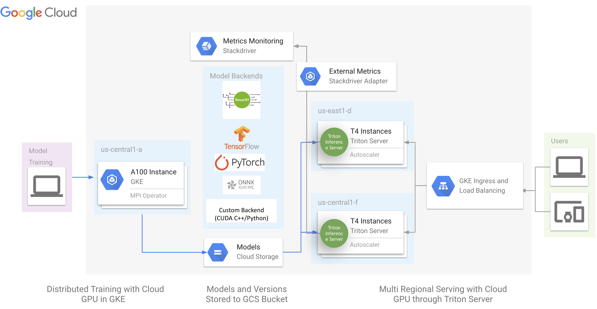
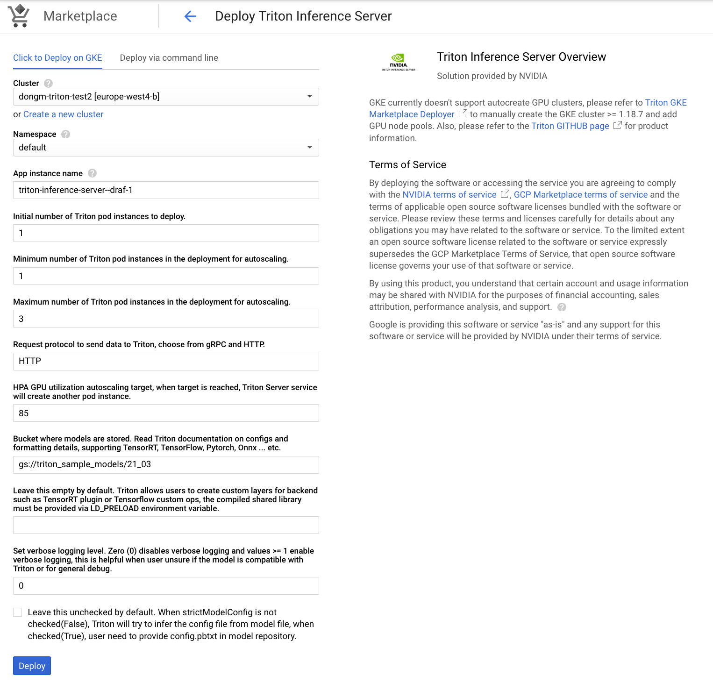
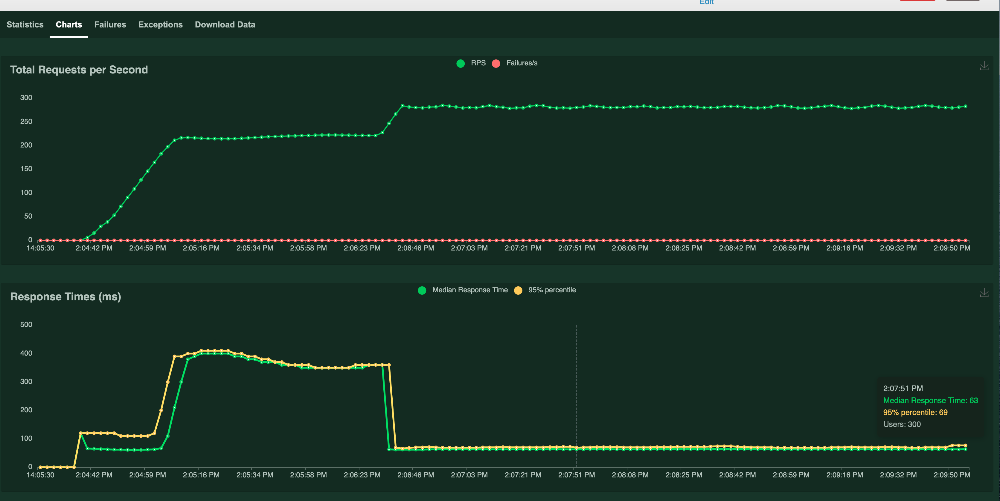

<!--
# Copyright (c) 2021-2024, NVIDIA CORPORATION & AFFILIATES. All rights reserved.
#
# Redistribution and use in source and binary forms, with or without
# modification, are permitted provided that the following conditions
# are met:
#  * Redistributions of source code must retain the above copyright
#    notice, this list of conditions and the following disclaimer.
#  * Redistributions in binary form must reproduce the above copyright
#    notice, this list of conditions and the following disclaimer in the
#    documentation and/or other materials provided with the distribution.
#  * Neither the name of NVIDIA CORPORATION nor the names of its
#    contributors may be used to endorse or promote products derived
#    from this software without specific prior written permission.
#
# THIS SOFTWARE IS PROVIDED BY THE COPYRIGHT HOLDERS ``AS IS'' AND ANY
# EXPRESS OR IMPLIED WARRANTIES, INCLUDING, BUT NOT LIMITED TO, THE
# IMPLIED WARRANTIES OF MERCHANTABILITY AND FITNESS FOR A PARTICULAR
# PURPOSE ARE DISCLAIMED.  IN NO EVENT SHALL THE COPYRIGHT OWNER OR
# CONTRIBUTORS BE LIABLE FOR ANY DIRECT, INDIRECT, INCIDENTAL, SPECIAL,
# EXEMPLARY, OR CONSEQUENTIAL DAMAGES (INCLUDING, BUT NOT LIMITED TO,
# PROCUREMENT OF SUBSTITUTE GOODS OR SERVICES; LOSS OF USE, DATA, OR
# PROFITS; OR BUSINESS INTERRUPTION) HOWEVER CAUSED AND ON ANY THEORY
# OF LIABILITY, WHETHER IN CONTRACT, STRICT LIABILITY, OR TORT
# (INCLUDING NEGLIGENCE OR OTHERWISE) ARISING IN ANY WAY OUT OF THE USE
# OF THIS SOFTWARE, EVEN IF ADVISED OF THE POSSIBILITY OF SUCH DAMAGE.
-->

# NVIDIA Triton Inference Server GKE Marketplace Application

**Table Of Contents**
- [NVIDIA Triton Inference Server GKE Marketplace Application](#nvidia-triton-inference-server-gke-marketplace-application)
  - [Description](#description)
  - [Prerequisites](#prerequisites)
  - [Demo Instruction](#demo-instruction)
  - [Additional Resources](#additional-resources)
  - [Known Issues](#known-issues)

## Description

This repository contains Google Kubernetes Engine(GKE) Marketplace Application for NVIDIA Triton Inference Server deployer.

 - Triton GKE deployer is a helm chart deployer recommended by GKE Marketplace
 - Triton GKE deployer deploys a GKE ingress which accepts public inference requests
 - Triton GKE deployer includes a horizontal pod autoscaler(HPA) which relies on [stack driver custom metrics adaptor](https://github.com/GoogleCloudPlatform/k8s-stackdriver/tree/master/custom-metrics-stackdriver-adapter) to monitor GPU duty cycle, and auto scale GPU nodes.
 - This repo also contains a sample to generate BERT model with TensorRT and use Locust to experiment with GPU node autoscaling and monitor client latency/throughput.



## Prerequisites

 - [Install Google Cloud SDK on your laptop/client workstation](https://cloud.google.com/sdk/docs/install), so that `gcloud` SDK cli interface could be run on the client and sign in with your GCP credentials.
 - In addition, user could leverage [Google Cloud shell](https://cloud.google.com/shell/docs/launching-cloud-shell).

## Demo Instruction

First, install this Triton GKE app to an existing GKE cluster with GPU node pool, Google Cloud Marketplace currently doesn't support auto creation of GPU clusters. User has to run following command to create a compatible cluster (gke version >=1.18.7) with GPU node pools, we recommend user to select T4 or A100(MIG) instances type and choose CPU ratio based on profiling of actual inference workflow.

Users need to follow these [instructions](https://cloud.google.com/kubernetes-engine/docs/how-to/kubernetes-service-accounts#creating_a_kubernetes_service_account) to create a kubernetes service account. In this example, we use `gke-test@k80-exploration.iam.gserviceaccount.com`. Make sure it has access to artifact registry and monitoring viewer. For example, to grant access to custom metrics which is required for HPA to work:
```
gcloud iam service-accounts add-iam-policy-binding --role \
  roles/iam.workloadIdentityUser --member \
  "serviceAccount:<project-id>.svc.id.goog[custom-metrics/custom-metrics-stackdriver-adapter]" \
  <google-service-account>@<project-id>.iam.gserviceaccount.com

kubectl annotate serviceaccount --namespace custom-metrics \
  custom-metrics-stackdriver-adapter \
  iam.gke.io/gcp-service-account=<google-service-account>@<project-id>.iam.gserviceaccount.com
```

Currently, GKE >= 1.18.7 only supported in GKE rapid channel, to find the latest version, please visit [GKE release notes](https://cloud.google.com/kubernetes-engine/docs/release-notes).
```
export PROJECT_ID=<your GCP project ID>
export ZONE=<GCP zone of your choice>
export REGION=<GCP region of your choice>
export DEPLOYMENT_NAME=<GKE cluster name, triton-gke for example>
# example: export SERVICE_ACCOUNT="gke-test@k80-exploration.iam.gserviceaccount.com"
export SERVICE_ACCOUNT=<Your GKE service account>

gcloud beta container clusters create ${DEPLOYMENT_NAME} \
--addons=HorizontalPodAutoscaling,HttpLoadBalancing \
--service-account=${SERVICE_ACCOUNT} \
--machine-type=n1-standard-8 \
--node-locations=${ZONE} \
--monitoring=SYSTEM \
--zone=${ZONE} \
--subnetwork=default \
--scopes cloud-platform \
--num-nodes 1 \
--project ${PROJECT_ID}

# add GPU node pools, user can modify number of node based on workloads
gcloud container node-pools create accel \
  --project ${PROJECT_ID} \
  --zone ${ZONE} \
  --cluster ${DEPLOYMENT_NAME} \
  --service-account=${SERVICE_ACCOUNT} \
  --num-nodes 2 \
  --accelerator type=nvidia-tesla-t4,count=1 \
  --enable-autoscaling --min-nodes 2 --max-nodes 3 \
  --machine-type n1-standard-4 \
  --disk-size=100 \
  --scopes cloud-platform \
  --verbosity error

# so that you can run kubectl locally to the cluster
gcloud container clusters get-credentials ${DEPLOYMENT_NAME} --project ${PROJECT_ID} --zone ${ZONE}

# deploy NVIDIA device plugin for GKE to prepare GPU nodes for driver install
kubectl apply -f https://raw.githubusercontent.com/GoogleCloudPlatform/container-engine-accelerators/master/nvidia-driver-installer/cos/daemonset-preloaded-latest.yaml

# make sure you can run kubectl locally to access the cluster
kubectl create clusterrolebinding cluster-admin-binding --clusterrole cluster-admin --user "$(gcloud config get-value account)"

# enable stackdriver custom metrics adaptor
kubectl apply -f https://raw.githubusercontent.com/GoogleCloudPlatform/k8s-stackdriver/master/custom-metrics-stackdriver-adapter/deploy/production/adapter_new_resource_model.yaml

# create an ip for ingress traffic
gcloud compute addresses create ingress-triton --global
```

Creating a cluster and adding GPU nodes could take up-to 10 minutes. Please be patient after executing this command. GPU resources in GCP could be fully utilized, so please try a different zone in case compute resource cannot be allocated. After GKE cluster is running, run `kubectl get pods --all-namespaces` to make sure the client can access the cluster correctly:

If user would like to experiment with A100 MIG partitioned GPU in GKE, please create node pool with following command:
```
gcloud beta container node-pools create accel \
  --project ${PROJECT_ID} \
  --zone ${ZONE} \
  --cluster ${DEPLOYMENT_NAME} \
  --service-account=${SERVICE_ACCOUNT} \
  --num-nodes 1 \
  --accelerator type=nvidia-tesla-a100,count=1,gpu-partition-size=1g.5gb  \
  --enable-autoscaling --min-nodes 1 --max-nodes 2 \
  --machine-type=a2-highgpu-1g  \
  --disk-size=100 \
  --scopes cloud-platform \
  --verbosity error
```

Please note that A100 MIG in GKE does not support GPU metrics yet, also Triton GPU Metrics is not compatible with A100 MIG. Hence, please disable GPU metrics by unselect allowGPUMetrics while deploy Triton GKE app. Also for the same reason, this deployer doesn't support inference workfload auto-scaling on A100 MIG as well.

Second, go to this [GKE Marketplace link](https://console.cloud.google.com/marketplace/details/nvidia-ngc-public/triton-inference-server) to deploy Triton application.

Users can leave everything as default if their models have already been tested/validated with Triton. They can provide a GCS path pointing to the model repository containing their models. By default, we provide a BERT large model optimized by TensorRT in a public demo GCS bucket that is compatible with the `xx.yy` release of Triton Server in `gs://triton_sample_models/xx_yy`. However, please take note of the following about this demo bucket:
- The TensorRT engine provided in the demo bucket is only compatible with Tesla T4 GPUs.
- This bucket is located in `us-central1`, so loading from this bucket into Triton in other regions may be affected.
- The first deployment of this Triton GKE application will be slower than consecutive runs because the image needs to be pulled into the GKE cluster.
- You can find an example of how this model is generated and uploaded [here](trt-engine/README.md).

Where <xx.yy> is the version of NGC Triton container needed.



We want to discuss HPA autoscaling metrics users can leverage. GPU Power(Percentage of Power) tends to be a reliable metric, especially for larger GPU like V100 and A100. GKE currently natively support GPU duty cycle which is GPU utilization in `nvidia-smi`. We ask users always profile their model to determine the autoscaling target and metrics. When attempting to select the right metrics for autoscaling, the goal should be to pick metrics based on the following: 1, meet SLA rrequirement. 2, give consideration to transient request load, 3, keep GPU as fully utilized as possible. Profiling comes in 2 aspects: If user decided to use Duty Cycle or other GPU metric, it is recommend establish baseline to link SLA requirement such as latency with GPU metrics, for example, for model A, latency will be below 10ms 99% of time when Duty Cycle is below 80% utilized. Additionally, profiling also provide insight to model optimization for inference, with tools like [Nsight](https://developer.nvidia.com/nsight-systems).

Once the application is deployed successfully, get the public ip from ingress:
```
> kubectl get ingress
NAME              CLASS    HOSTS   ADDRESS          PORTS   AGE
triton-external   <none>   *       35.186.215.182   80      107s
```

Third, we will try sending request to server with provide client example.

If User selected deploy Triton to accept HTTP request, please launch [Locust](https://docs.locust.io/en/stable/installation.html) with Ingress host and port to query Triton Inference Server. In this [example script](https://github.com/triton-inference-server/server/tree/master/deploy/gke-marketplace-app/client-sample/locustfile_bert.py), we send request to Triton server which has loaded a BERT large TensorRT Engine with Sequence length of 128 into GCP bucket. We simulate 1000 concurrent user as target and spawn user at rate of 50 users per second.
```
locust -f locustfile_bert.py -H http://${INGRESS_HOST}:${INGRESS_PORT}
```

The client example push about ~650 QPS(Query per second) to Triton Server, and will trigger a auto scale of T4 GPU nodes (We recommend to use T4 and A100[MIG] for inference). From locust UI, we will observer a drop of latency mean and variance for the requests. At the end, after autoscaling, we see the latency stablized at ~200 ms, end to end from US client to europe server, which is excellent for a model that has 345 million parameters. Since for each node, we use 1T4 + n1-standard-4 instance, and it can handle ~450 QPS, with on-demand price, it is ($0.35+$0.19)=$0.54/hr, that translate to 3 million inference per dollar for BERT large model at batch size 1. Further more, with 3 year commitment price, hr rate is ($0.16+$0.08)=$0.24/hr, that translate to 6.75 million inference per dollar.



Alternatively, user can opt to use
[Perf Analyzer](https://github.com/triton-inference-server/perf_analyzer/blob/main/README.md)
to profile and study the performance of Triton Inference Server. Here we also
provide a
[client script](https://github.com/triton-inference-server/server/tree/master/deploy/gke-marketplace-app/client-sample/perf_analyzer_grpc.sh)
to use Perf Analyzer to send gRPC to Triton Server GKE deployment. Perf Analyzer
client requires user to use NGC Triton Client Container.

```
bash perf_analyzer_grpc.sh ${INGRESS_HOST}:${INGRESS_PORT}
```

## Additional Resources

See the following resources to learn more about NVIDIA Triton Inference Server and GKE GPU capabilities.

**Documentation**

- [GPU in Google Kubernetes Engine](https://cloud.google.com/kubernetes-engine/docs/how-to/gpus)
- [Optimize GPU Performance in Google Cloud Platform](https://cloud.google.com/compute/docs/gpus/optimize-gpus)
- [Triton Inference Server](https://github.com/triton-inference-server/server)
- [AI Platform Prediction: Custom container concepts with Triton Server](https://cloud.google.com/solutions/ai-platform-prediction-custom-container-concepts) by [Kevin Tsai](https://github.com/merlin1649)
- [AI Platform Prediction: Direct model server setup for NVIDIA Triton Inference Server](https://cloud.google.com/solutions/ai-platform-prediction-direct-model-server-nvidia) by [Kevin Tsai](https://github.com/merlin1649)

## Known Issues

- GKE one click cluster creation doesn't support GPU node pools at the moment, users have to manually create a compatible (>=1.18.7) cluster and attach node pool (T4 and A100 MIG recommended)
- When Horizontal Pod Autoscaler(HPA) expand and all GPU node pool already utilized, GKE will request new GPU node and it can take between 4-7 minutes, it could be a long wait plus GPU driver install and image pulling. We recommend user to leverage multi-tier model serving and Triton's priority feature to create cushion for latency critical models, and allocate active standby GPU node for spike of requests.
