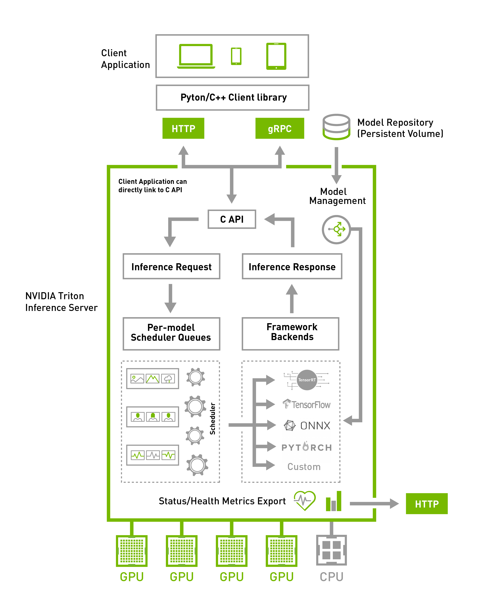
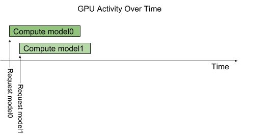
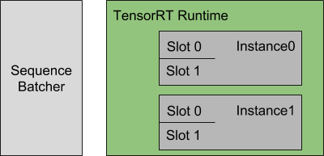
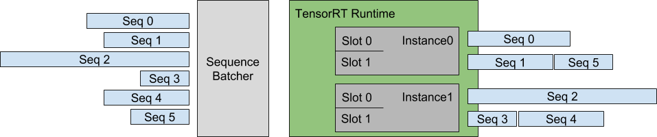
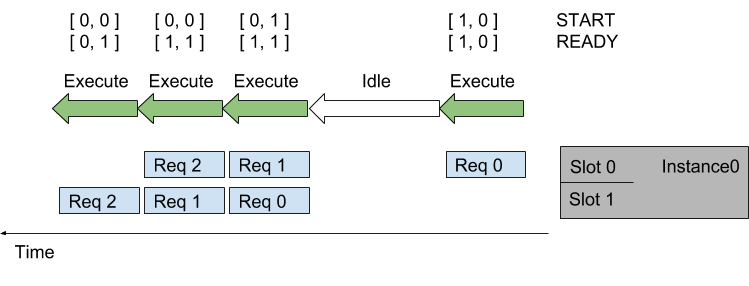
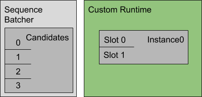
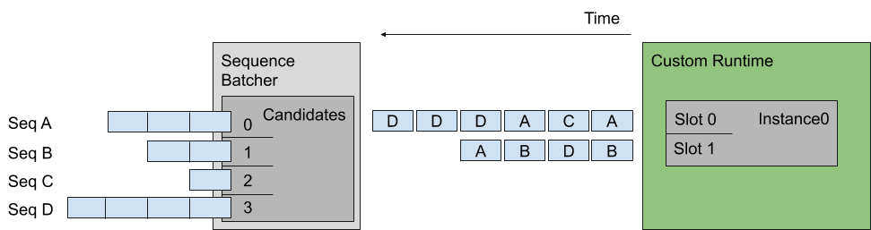
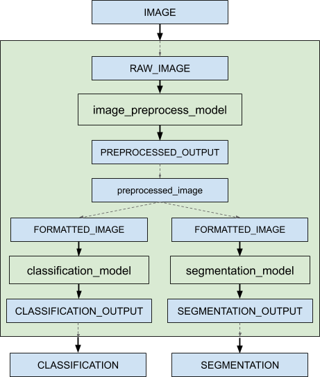

<!--
# Copyright (c) 2018-2020, NVIDIA CORPORATION. All rights reserved.
#
# Redistribution and use in source and binary forms, with or without
# modification, are permitted provided that the following conditions
# are met:
#  * Redistributions of source code must retain the above copyright
#    notice, this list of conditions and the following disclaimer.
#  * Redistributions in binary form must reproduce the above copyright
#    notice, this list of conditions and the following disclaimer in the
#    documentation and/or other materials provided with the distribution.
#  * Neither the name of NVIDIA CORPORATION nor the names of its
#    contributors may be used to endorse or promote products derived
#    from this software without specific prior written permission.
#
# THIS SOFTWARE IS PROVIDED BY THE COPYRIGHT HOLDERS ``AS IS'' AND ANY
# EXPRESS OR IMPLIED WARRANTIES, INCLUDING, BUT NOT LIMITED TO, THE
# IMPLIED WARRANTIES OF MERCHANTABILITY AND FITNESS FOR A PARTICULAR
# PURPOSE ARE DISCLAIMED.  IN NO EVENT SHALL THE COPYRIGHT OWNER OR
# CONTRIBUTORS BE LIABLE FOR ANY DIRECT, INDIRECT, INCIDENTAL, SPECIAL,
# EXEMPLARY, OR CONSEQUENTIAL DAMAGES (INCLUDING, BUT NOT LIMITED TO,
# PROCUREMENT OF SUBSTITUTE GOODS OR SERVICES; LOSS OF USE, DATA, OR
# PROFITS; OR BUSINESS INTERRUPTION) HOWEVER CAUSED AND ON ANY THEORY
# OF LIABILITY, WHETHER IN CONTRACT, STRICT LIABILITY, OR TORT
# (INCLUDING NEGLIGENCE OR OTHERWISE) ARISING IN ANY WAY OUT OF THE USE
# OF THIS SOFTWARE, EVEN IF ADVISED OF THE POSSIBILITY OF SUCH DAMAGE.
-->

# Triton Architecture

The following figure shows the Triton Inference Server high-level
architecture. The [model repository](model_repository.md) is a
file-system based repository of the models that Triton will make
available for inferencing. Inference requests arrive at the server via
either [HTTP/REST or GRPC](inference_protocols.md) or by the [C
API](inference_protocols.md) and are then routed to the appropriate per-model
scheduler. Triton implements [multiple scheduling and batching
algorithms](#models-and-schedulers) that can be configured on a
model-by-model basis. Each model's scheduler optionally performs
batching of inference requests and then passes the requests to the
[backend](https://github.com/triton-inference-server/backend/blob/main/README.md)
corresponding to the model type. The backend performs inferencing
using the inputs provided in the batched requests to produce the
requested outputs. The outputs are then returned.

Triton supports a [backend C
API](https://github.com/triton-inference-server/backend/blob/main/README.md#triton-backend-api)
that allows Triton to be extended with new functionality such as
custom pre- and post-processing operations or even a new deep-learning
framework.

The models being served by Triton can be queried and controlled by a
dedicated [model management API](model_management.md) that is
available by HTTP/REST or GRPC protocol, or by the C API.

Readiness and liveness health endpoints and utilization, throughput
and latency metrics ease the integration of Triton into deployment
framework such as Kubernetes.



## Concurrent Model Execution

The Triton architecture allows multiple models and/or multiple
instances of the same model to execute in parallel on the same
system. The system may have zero, one, or many GPUs. The following
figure shows an example with two models; model0 and model1. Assuming
Triton is not currently processing any request, when two requests
arrive simultaneously, one for each model, Triton immediately
schedules both of them onto the GPU and the GPU’s hardware scheduler
begins working on both computations in parallel. Models executing on
the system's CPU are handled similarly by Triton except that the
scheduling of the CPU threads execution each model is handled by the
system's OS.



By default, if multiple requests for the same model arrive at the same
time, Triton will serialize their execution by scheduling only one at
a time on the GPU, as shown in the following figure.


Triton provides a [model configuration option called
instance-group](model_configuration.md#instance-groups) that allows
each model to specify how many parallel executions of that model
should be allowed. Each such enabled parallel execution is referred to
as an *instance*. By default, Triton gives each model a single
instance for each available GPU in the system. By
using the instance_group field in the model configuration, the number
of execution instances for a model can
be changed. The following figure shows model execution when model1
is configured to allow three instances. As shown in the figure, the
first three model1 inference requests are immediately executed in
parallel. The fourth model1 inference request must wait until one of
the first three executions completes before beginning.


## Models And Schedulers

Triton supports multiple scheduling and batching algorithms that can
be selected independently for each model.  This section describes
*stateless*, *stateful* and *ensemble* models and how Triton provides
schedulers to support those model types. For a given model, the
selection and configuration of the scheduler is done with the [model's
configuration file](model_configuration.md).

### Stateless Models

With respect to Triton's schedulers, a *stateless* model does not
maintain state between inference requests. Each inference performed on
a stateless model is independent of all other inferences using that
model.

Examples of stateless models are CNNs such as image classification and
object detection. The [default
scheduler](model_configuration.md#default-scheduler) or [dynamic
batcher](model_configuration.md#dynamic-batcher) can be used as the
scheduler for these stateless models.

RNNs and similar models which do have internal memory can be stateless
as long as the state they maintain does not span inference
requests. For example, an RNN that iterates over all elements in a
batch is considered stateless by Triton if the internal state is not
carried between batches of inference requests. The [default
scheduler](model_configuration.md#default-scheduler) can be used for
these stateless models. The [dynamic
batcher](model_configuration.md#dynamic-batcher) cannot be used since
the model is typically not expecting the batch to represent multiple
inference requests.

### Stateful Models

With respect to Triton's schedulers, a *stateful* model does maintain
state between inference requests. The model is expecting multiple
inference requests that together form a sequence of inferences that
must be routed to the same model instance so that the state being
maintained by the model is correctly updated. Moreover, the model may
require that Triton provide *control* signals indicating, for example,
the start and end of the sequence.

The [sequence batcher](model_configuration.md#sequence-batcher) must
be used for these stateful models. As explained below, the sequence
batcher ensures that all inference requests in a sequence get routed
to the same model instance so that the model can maintain state
correctly. The sequence batcher also communicates with the model to
indicate when a sequence is starting, when a sequence is ending, when
a sequence has an inference request ready for execution, and the
*correlation ID* of the sequence.

When making inference requests for a stateful model, the client
application must provide the same correlation ID to all requests in a
sequence, and must also mark the start and end of the sequence. The
correlation ID allows Triton to identify that the requests belong to
the same sequence.

#### Control Inputs

For a stateful model to operate correctly with the sequence batcher,
the model must typically accept one or more *control* input tensors
that Triton uses to communicate with the model. The
*ModelSequenceBatching::Control* section of the [model
configuration](model_configuration.md) indicates how the model exposes
the tensors that the sequence batcher should use for these
controls. All controls are optional. Below is portion of a model
configuration that shows an example configuration for all the
available control signals.

```
sequence_batching {
  control_input [
    {
      name: "START"
      control [
        {
          kind: CONTROL_SEQUENCE_START
          fp32_false_true: [ 0, 1 ]
        }
      ]
    },
    {
      name: "END"
      control [
        {
          kind: CONTROL_SEQUENCE_END
          fp32_false_true: [ 0, 1 ]
        }
      ]
    },
    {
      name: "READY"
      control [
        {
          kind: CONTROL_SEQUENCE_READY
          fp32_false_true: [ 0, 1 ]
        }
      ]
    },
    {
      name: "CORRID"
      control [
        {
          kind: CONTROL_SEQUENCE_CORRID
          data_type: TYPE_UINT64
        }
      ]
    }
  ]
}
```

* **Start**: The start input tensor is specified using
  CONTROL_SEQUENCE_START in the configuration. The example
  configuration indicates that the model has an input tensor called
  START with a 32-bit floating point data-type. The sequence batcher
  will define this tensor when executing an inference on the
  model. The START tensor must be 1-dimensional with size equal to the
  batch-size. Each element in the tensor indicates if the sequence in
  the corresponding batch slot is starting or not. In the example
  configuration, fp32_false_true indicates that a sequence start is
  indicated by tensor element equal to 1, and non-start is indicated
  by tensor element equal to 0.

* **End**: The end input tensor is specified using
  CONTROL_SEQUENCE_END in the configuration. The example configuration
  indicates that the model has an input tensor called END with a
  32-bit floating point data-type. The sequence batcher will define
  this tensor when executing an inference on the model. The END tensor
  must be 1-dimensional with size equal to the batch-size. Each
  element in the tensor indicates if the sequence in the corresponding
  batch slot is ending or not. In the example configuration,
  fp32_false_true indicates that a sequence end is indicated by tensor
  element equal to 1, and non-end is indicated by tensor element equal
  to 0.

* **Ready**: The ready input tensor is specified using
  CONTROL_SEQUENCE_READY in the configuration. The example
  configuration indicates that the model has an input tensor called
  READY with a 32-bit floating point data-type. The sequence batcher
  will define this tensor when executing an inference on the
  model. The READY tensor must be 1-dimensional with size equal to the
  batch-size. Each element in the tensor indicates if the sequence in
  the corresponding batch slot has an inference request ready for
  inference. In the example configuration, fp32_false_true indicates
  that a sequence ready is indicated by tensor element equal to 1, and
  non-ready is indicated by tensor element equal to 0.

* **Correlation ID**: The correlation ID input tensor is specified
  using CONTROL_SEQUENCE_CORRID in the configuration. The example
  configuration indicates that the model has an input tensor called
  CORRID with a unsigned 64-bit integer data-type. The sequence
  batcher will define this tensor when executing an inference on the
  model. The CORRID tensor must be 1-dimensional with size equal to
  the batch-size. Each element in the tensor indicates the correlation
  ID of the sequence in the corresponding batch slot.

#### Implicit State Management

Implicit state management allows a stateful model to store its state inside
Triton. When using implicit state, the stateful model does not need to store
the state required for inference inside the model.

Below is a portion of the model configuration that indicates the model
is using implicit state.

```
sequence_batching {
  state [
    {
      input_name: "INPUT_STATE"
      output_name: "OUTPUT_STATE"
      data_type: TYPE_INT32
      dims: [ -1 ]
    }
  ]
}
```

The *state* section in the sequence_batching setting is used to indicate that
the model is using implicit state. The *input_name* field specifies the name of
the input tensor that will contain the input state. The *output_name* field
describes the name of the output tensor produced by the model that contains
output state. The output state provided by the model in the *i<sup>th</sup>*
request in the sequence will be used as the input state in the
*i+1<sup>th</sup>* request. The *dims* field specifies the dimensions of the
state tensors. When the *dims* field contains variable-sized dimensions, the
shape of the input state and output state does not have to match.

For debugging purposes, the client can request the output state. In order to
allow the client to request the output state, the
[*output* section of the model configuration](./model_configuration.md#inputs-and-outputs)
must list the output state as one of the model outputs. Note that requesting the
output state from the client can increase the request latency because of the
additional tensors that have to be transferred.

Implicit state management requires backend support. Currently, only
[onnxruntime_backend](https://github.com/triton-inference-server/onnxruntime_backend)
and [tensorrt_backend](https://github.com/triton-inference-server/tensorrt_backend)
support implicit state.

##### State Initialization

By default, the starting request in the sequence contains uninitialized data for
the input state. The model can use the start flag in the request to detect the
beginning of a new sequence and initialize the model state by providing the
initial state in the model output. If the *dims* section in the *state*
description of the model contains variable-sized dimensions, Triton will use *1*
for every variable-sized dimension for the starting request. For other
non-starting requests in the sequence, the input state is the output state of
the previous request in the sequence. For an example ONNX model that uses
implicit state you can refer to
[this ONNX model](../qa/common/gen_qa_implicit_models.py#L101).
This is a simple accumulator model that stores the partial sum of the requests
in a sequence in Triton using implicit state. For state initialization, if the
request is starting, the model sets the "OUTPUT\_STATE" to be equal to the
"INPUT" tensor. For non-starting requests, it sets the "OUTPUT\_STATE" tensor
to the sum of "INPUT" and "INPUT\_STATE" tensors.

In addition to the default state initilization discussed above, Triton provides
two other mechanisms for initilizing state.

###### Initializing State from Zero.

Below is an example of initializing state from zero.

```
sequence_batching {
  state [
    {
      input_name: "INPUT_STATE"
      output_name: "OUTPUT_STATE"
      data_type: TYPE_INT32
      dims: [ -1 ]
      initial_state: {
       data_type: TYPE_INT32
       dims: [ 1 ]
       zero_data: true
       name: "initial state"
      }
    }
  ]
}
```

Note that in the example above variable dimensions in the state description are
converted to fixed size dimensions.

###### Initializing State from File

For initializing state from file, you need to create a directory named
"initial\_state" under the model directory. The file that contains the initial
state under this directory needs to be provided in the *data_file* field. 
The data stored in this file will be used in row-major order as the initial
state. Below is an example state description initializing state from file.

```
sequence_batching {
  state [
    {
      input_name: "INPUT_STATE"
      output_name: "OUTPUT_STATE"
      data_type: TYPE_INT32
      dims: [ -1 ]
      initial_state: {
       data_type: TYPE_INT32
       dims: [ 1 ]
       data_file: "initial_state_data"
       name: "initial state"
      }
    }
  ]
}
```

#### Scheduling Strategies

The sequence batcher can employ one of two scheduling strategies when
deciding how to batch the sequences that are routed to the same model
instance. These strategies are [direct](#direct) and [oldest](#oldest).

##### Direct

With the Direct scheduling strategy the sequence batcher ensures not
only that all inference requests in a sequence are routed to the same
model instance, but also that each sequence is routed to a dedicated
batch slot within the model instance. This strategy is required when
the model maintains state for each batch slot, and is expecting all
inference requests for a given sequence to be routed to the same slot
so that the state is correctly updated.

As an example of the sequence batcher using the Direct scheduling
strategy, assume a TensorRT stateful model that has the following
model configuration.

```
name: "direct_stateful_model"
platform: "tensorrt_plan"
max_batch_size: 2
sequence_batching {
  max_sequence_idle_microseconds: 5000000
  direct { }
  control_input [
    {
      name: "START"
      control [
        {
          kind: CONTROL_SEQUENCE_START
          fp32_false_true: [ 0, 1 ]
        }
      ]
    },
    {
      name: "READY"
      control [
        {
          kind: CONTROL_SEQUENCE_READY
          fp32_false_true: [ 0, 1 ]
        }
      ]
    }
  ]
}
input [
  {
    name: "INPUT"
    data_type: TYPE_FP32
    dims: [ 100, 100 ]
  }
]
output [
  {
    name: "OUTPUT"
    data_type: TYPE_FP32
    dims: [ 10 ]
  }
]
instance_group [
  {
    count: 2
  }
]
```

The sequence_batching section indicates that the model should use the
sequence batcher and the Direct scheduling strategy. In this example
the model only requires a *start* and *ready* control input from the
sequence batcher so only those controls are listed. The instance_group
indicates two instances of the model should be instantiated and
max_batch_size indicates that each of those instances should perform
batch-size 2 inferences. The following figure shows a representation
of the sequence batcher and the inference resources specified by this
configuration.



Each model instance is maintaining state for each batch slot, and is
expecting all inference requests for a given sequence to be routed to
the same slot so that the state is correctly updated. For this example
that means that Triton can simultaneously perform inference for up to
four sequences.

Using the Direct scheduling strategy, the sequence batcher:

* Recognizes when an inference request starts a new sequence and
  allocates a batch slot for that sequence. If no batch slot is
  available for the new sequence, Triton places the inference request
  in a backlog.

* Recognizes when an inference request is part of a sequence that has
  an allocated batch slot and routes the request to that slot.

* Recognizes when an inference request is part of a sequence that is
  in the backlog and places the request in the backlog.

* Recognizes when the last inference request in a sequence has been
  completed. The batch slot occupied by that sequence is immediately
  reallocated to a sequence in the backlog, or freed for a future
  sequence if there is no backlog.

The following figure shows how multiple sequences are scheduled onto
the model instances using the Direct scheduling strategy. On the left
the figure shows several sequences of requests arriving at
Triton. Each sequence could be made up of any number of inference
requests and those individual inference requests could arrive in any
order relative to inference requests in other sequences, except that
the execution order shown on the right assumes that the first
inference request of sequence 0 arrives before any inference request
in sequences 1-5, the first inference request of sequence 1 arrives
before any inference request in sequences 2-5, etc.

The right of the figure shows how the inference request sequences are
scheduled onto the model instances over time.



The following figure shows the sequence batcher uses the control input
tensors to communicate with the model. The figure shows two sequences
assigned to the two batch slots in a model instance. Inference
requests for each sequence arrive over time. The START and READY rows
show the input tensor values used for each execution of the
model. Over time the following happens:

* The first request arrives for the sequence in slot0. Assuming the
  model instance is not already executing an inference, the sequence
  scheduler immediately schedules the model instance to execute
  because an inference request is available.

* This is the first request in the sequence so the corresponding
  element in the START tensor is set to 1. There is no request
  available in slot1 so the READY tensor shows only slot0 as ready.

* After the inference completes the sequence scheduler sees that there
  are no requests available in any batch slot and so the model
  instance sits idle.

* Next, two inference requests arrive close together in time so that
  the sequence scheduler sees them both available in their respective
  batch slots. The scheduler immediately schedules the model instance
  to perform a batch-size 2 inference and uses START and READY to show
  that both slots have an inference request avaiable but that only
  slot1 is the start of a new sequence.

* The processing continues in a similar manner for the other inference
  requests.



##### Oldest

With the Oldest scheduling strategy the sequence batcher ensures that
all inference requests in a sequence are routed to the same model
instance and then uses the [dynamic
batcher](model_configuration.md#dynamic-batcher) to batch together
multiple inferences from different sequences into a batch that
inferences together.  With this strategy the model must typically use
the CONTROL_SEQUENCE_CORRID control so that it knows which sequence
each inference request in the batch belongs to. The
CONTROL_SEQUENCE_READY control is typically not needed because all
inferences in the batch will always be ready for inference.

As an example of the sequence batcher using the Oldest scheduling
strategy, assume a stateful model that has the following model
configuration:

```
name: "oldest_stateful_model"
platform: "tensorflow_savedmodel"
max_batch_size: 2
sequence_batching {
  max_sequence_idle_microseconds: 5000000
  oldest
    {
      max_candidate_sequences: 4
    }
  control_input [
    {
      name: "START"
      control [
        {
          kind: CONTROL_SEQUENCE_START
          fp32_false_true: [ 0, 1 ]
        }
      ]
    },
    {
      name: "END"
      control [
        {
          kind: CONTROL_SEQUENCE_END
          fp32_false_true: [ 0, 1 ]
        }
      ]
    },
    {
      name: "CORRID"
      control [
        {
          kind: CONTROL_SEQUENCE_CORRID
          data_type: TYPE_UINT64
        }
      ]
    }
  ]
}
input [
  {
    name: "INPUT"
    data_type: TYPE_FP32
    dims: [ 100, 100 ]
  }
]
output [
  {
    name: "OUTPUT"
    data_type: TYPE_FP32
    dims: [ 10 ]
  }
]
```

The sequence_batching section indicates that the model should use the
sequence batcher and the Oldest scheduling strategy. The Oldest
strategy is configured so that the sequence batcher maintains up to 4
active candidate sequences from which it prefers to form dynamic
batches of size 2. In this example the model requires a *start*,
*end*, and *correlation ID* control input from the sequence
batcher. The following figure shows a representation of the sequence
batcher and the inference resources specified by this configuration.



Using the Oldest scheduling strategy, the sequence batcher:

* Recognizes when an inference request starts a new sequence and
  attempts to find a model instance that has room for a candidate
  sequence. If no model instance has room for a new candidate
  sequence, Triton places the inference request in a backlog.

* Recognizes when an inference request is part of a sequence that is
  already a candidate sequence in some model instance and routes the
  request to that model instance.

* Recognizes when an inference request is part of a sequence that is
  in the backlog and places the request in the backlog.

* Recognizes when the last inference request in a sequence has been
  completed. The model instance immediately removes a sequence from
  the backlog and makes it a candidate sequence in the model instance,
  or records that the model instance can handle a future sequence if
  there is no backlog.

The following figure shows how multiple sequences are scheduled onto
the model instance specified by the above example configuration. On
the left the figure shows four sequences of requests arriving at
Triton. Each sequence is composed of multiple inference requests as
shown in the figure. The center of the figure shows how the inference
request sequences are batched onto the model instance over time,
assuming that the inference requests for each sequence arrive at the
same rate with sequence A arriving just before B, which arrives just
before C, etc. The Oldest strategy forms a dynamic batch from the
oldest requests but never includes more than one request from a given
sequence in a batch (for example, the last two inferences in sequence
D are not batched together).



### Ensemble Models

An ensemble model represents a *pipeline* of one or more models and
the connection of input and output tensors between those
models. Ensemble models are intended to be used to encapsulate a
procedure that involves multiple models, such as "data preprocessing
-> inference -> data postprocessing".  Using ensemble models for this
purpose can avoid the overhead of transferring intermediate tensors
and minimize the number of requests that must be sent to Triton.

The ensemble scheduler must be used for ensemble models, regardless of
the scheduler used by the models within the ensemble. With respect to
the ensemble scheduler, an *ensemble* model is not an actual
model. Instead, it specifies the dataflow between models within the
ensemble as *ModelEnsembling::Step* entries in the model
configuration. The scheduler collects the output tensors in each step,
provides them as input tensors for other steps according to the
specification. In spite of that, the ensemble model is still viewed as
a single model from an external view.

Note that the ensemble models will inherit the characteristics of the
models involved, so the meta-data in the request header must comply
with the models within the ensemble. For instance, if one of the
models is stateful model, then the inference request for the ensemble
model should contain the information mentioned in [Stateful
Models](#stateful-models), which will be provided to the stateful
model by the scheduler.

As an example consider an ensemble model for image classification and
segmentation that has the following model configuration:

```
name: "ensemble_model"
platform: "ensemble"
max_batch_size: 1
input [
  {
    name: "IMAGE"
    data_type: TYPE_STRING
    dims: [ 1 ]
  }
]
output [
  {
    name: "CLASSIFICATION"
    data_type: TYPE_FP32
    dims: [ 1000 ]
  },
  {
    name: "SEGMENTATION"
    data_type: TYPE_FP32
    dims: [ 3, 224, 224 ]
  }
]
ensemble_scheduling {
  step [
    {
      model_name: "image_preprocess_model"
      model_version: -1
      input_map {
        key: "RAW_IMAGE"
        value: "IMAGE"
      }
      output_map {
        key: "PREPROCESSED_OUTPUT"
        value: "preprocessed_image"
      }
    },
    {
      model_name: "classification_model"
      model_version: -1
      input_map {
        key: "FORMATTED_IMAGE"
        value: "preprocessed_image"
      }
      output_map {
        key: "CLASSIFICATION_OUTPUT"
        value: "CLASSIFICATION"
      }
    },
    {
      model_name: "segmentation_model"
      model_version: -1
      input_map {
        key: "FORMATTED_IMAGE"
        value: "preprocessed_image"
      }
      output_map {
        key: "SEGMENTATION_OUTPUT"
        value: "SEGMENTATION"
      }
    }
  ]
}
```

The ensemble\_scheduling section indicates that the ensemble scheduler will be
used and that the ensemble model consists of three different models. Each
element in step section specifies the model to be used and how the inputs and
outputs of the model are mapped to tensor names recognized by the scheduler. For
example, the first element in step specifies that the latest version of
image\_preprocess\_model should be used, the content of its input "RAW\_IMAGE"
is provided by "IMAGE" tensor, and the content of its output
"PREPROCESSED\_OUTPUT" will be mapped to "preprocessed\_image" tensor for later
use. The tensor names recognized by the scheduler are the ensemble inputs, the
ensemble outputs and all values in the input\_map and the output\_map.

The models composing the ensemble may also have dynamic batching
enabled.  Since ensemble models are just routing the data between
composing models, Triton can take requests into an ensemble model
without modifying the ensemble's configuration to exploit the dynamic
batching of the composing models.

Assuming that only the ensemble model, the preprocess model, the classification
model and the segmentation model are being served, the client applications will
see them as four different models which can process requests independently.
However, the ensemble scheduler will view the ensemble model as the following.



When an inference request for the ensemble model is received, the ensemble
scheduler will:

1. Recognize that the "IMAGE" tensor in the request is mapped to input
   "RAW\_IMAGE" in the preprocess model.

2. Check models within the ensemble and send an internal request to the
   preprocess model because all the input tensors required are ready.

3. Recognize the completion of the internal request, collect the output
   tensor and map the content to "preprocessed\_image" which is an unique name
   known within the ensemble.

4. Map the newly collected tensor to inputs of the models within the ensemble.
   In this case, the inputs of "classification\_model" and "segmentation\_model"
   will be mapped and marked as ready.

5. Check models that require the newly collected tensor and send internal
   requests to models whose inputs are ready, the classification
   model and the segmentation model in this case. Note that the responses will
   be in arbitrary order depending on the load and computation time of
   individual models.

6. Repeat step 3-5 until no more internal requests should be sent, and then
   response to the inference request with the tensors mapped to the ensemble
   output names.

#### Additional Resources

You can find additional end-to-end ensemble examples in the links below:

* [Preprocessing in Python Backend Using
  Ensemble](https://github.com/triton-inference-server/python_backend#preprocessing)
* [Accelerating Inference with NVIDIA Triton Inference Server and NVIDIA
  DALI](https://developer.nvidia.com/blog/accelerating-inference-with-triton-inference-server-and-dali/)
* [Using RAPIDS AI with NVIDIA Triton Inference
  Server](https://github.com/rapidsai/rapids-examples/tree/main/rapids_triton_example)

