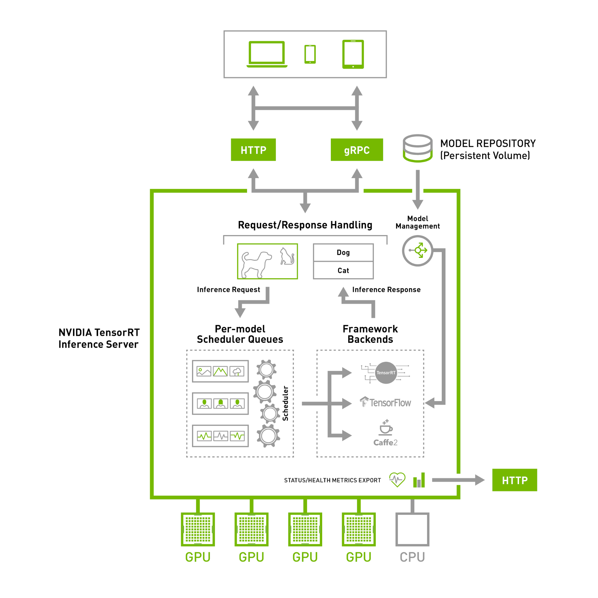
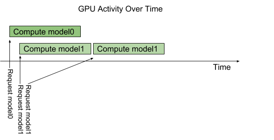
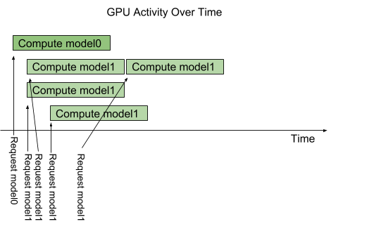
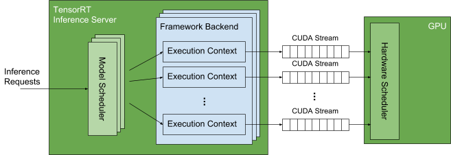

..
  # Copyright (c) 2018-2019, NVIDIA CORPORATION. All rights reserved.
  #
  # Redistribution and use in source and binary forms, with or without
  # modification, are permitted provided that the following conditions
  # are met:
  #  * Redistributions of source code must retain the above copyright
  #    notice, this list of conditions and the following disclaimer.
  #  * Redistributions in binary form must reproduce the above copyright
  #    notice, this list of conditions and the following disclaimer in the
  #    documentation and/or other materials provided with the distribution.
  #  * Neither the name of NVIDIA CORPORATION nor the names of its
  #    contributors may be used to endorse or promote products derived
  #    from this software without specific prior written permission.
  #
  # THIS SOFTWARE IS PROVIDED BY THE COPYRIGHT HOLDERS ``AS IS'' AND ANY
  # EXPRESS OR IMPLIED WARRANTIES, INCLUDING, BUT NOT LIMITED TO, THE
  # IMPLIED WARRANTIES OF MERCHANTABILITY AND FITNESS FOR A PARTICULAR
  # PURPOSE ARE DISCLAIMED.  IN NO EVENT SHALL THE COPYRIGHT OWNER OR
  # CONTRIBUTORS BE LIABLE FOR ANY DIRECT, INDIRECT, INCIDENTAL, SPECIAL,
  # EXEMPLARY, OR CONSEQUENTIAL DAMAGES (INCLUDING, BUT NOT LIMITED TO,
  # PROCUREMENT OF SUBSTITUTE GOODS OR SERVICES; LOSS OF USE, DATA, OR
  # PROFITS; OR BUSINESS INTERRUPTION) HOWEVER CAUSED AND ON ANY THEORY
  # OF LIABILITY, WHETHER IN CONTRACT, STRICT LIABILITY, OR TORT
  # (INCLUDING NEGLIGENCE OR OTHERWISE) ARISING IN ANY WAY OUT OF THE USE
  # OF THIS SOFTWARE, EVEN IF ADVISED OF THE POSSIBILITY OF SUCH DAMAGE.

Architecture
============

The following figure shows the TensorRT Inference Server high-level
architecture. The :ref:`model repository <section-model-repository>`
is a file-system based repository of the models that the inference
server will make available for inferencing. Inference requests arrive
at the server via either :ref:`HTTP or GRPC
<section-http-and-grpc-api>` or by :ref:`C API <section-library-api>`
and are then routed to the appropriate per-model scheduler. The
inference server implements multiple scheduling and batching
algorithms that can be configured on a model-by-model basis. Each
model's configured scheduler optionally performs batching of inference
requests and then passes the requests to the framework backend
corresponding to the model type. The framework backend performs
inferencing using the inputs provided in the request to produce the
requested outputs. The outputs are then formatted and a response is
sent.

.. _section-concurrent-model-execution:

Concurrent Model Execution
--------------------------

The TensorRT Inference Server architecture allows multiple models
and/or multiple instances of the same model to execute in parallel on
a single GPU. The following figure shows an example with two models;
model0 and model1. Assuming the server is not currently processing any
request, when two requests arrive simultaneously, one for each model,
the server immediately schedules both of them onto the GPU and the
GPU’s hardware scheduler begins working on both computations in
parallel.

.. image:: images/multi_model_exec.png

By default, if multiple requests for the same model arrive at the same
time, the inference server will serialize their execution by
scheduling only one at a time on the GPU, as shown in the following
figure.

The TensorRT inference server provides an :ref:`instance-group
<section-instance-groups>` feature that allows each model to specify
how many parallel executions of that model should be allowed. Each
such enabled parallel execution is referred to as an *execution
instance*. By default, the server gives each model a single execution
instance, which means that only a single execution of the model is
allowed to be in progress at a time as shown in the above figure. By
using instance-group the number of execution instances for a model can
be increased. The following figure shows model execution when model1
is configured to allow three execution instances. As shown in the
figure, the first three model1 inference requests are immediately
executed in parallel on the GPU. The fourth model1 inference request
must wait until one of the first three executions completes before
beginning.

To provide the current model execution capabilities shown in the above
figures, the inference server uses `CUDA streams
<https://devblogs.nvidia.com/gpu-pro-tip-cuda-7-streams-simplify-concurrency/>`_
to exploit the GPU’s hardware scheduling capabilities. CUDA streams
allow the server to communicate independent sequences of memory-copy
and kernel executions to the GPU. The hardware scheduler in the GPU
takes advantage of the independent execution streams to fill the GPU
with independent memory-copy and kernel executions. For example, using
streams allows the GPU to execute a memory-copy for one model, a
kernel for another model, and a different kernel for yet another model
at the same time.

The following figure shows some details of how this works within the
TensorRT Inference Server. Each framework backend (TensorRT,
TensorFlow, Caffe2) provides an API for creating an execution context
that is used to execute a given model (each framework uses different
terminology for this concept but here we refer to them generally as
execution contexts). Each framework allows an execution context to be
associated with a CUDA stream. This CUDA stream is used by the
framework to execute all memory copies and kernels needed for the
model associated with the execution context. For a given model, the
inference server creates one execution context for each execution
instance specified for the model. When an inference request arrives
for a given model, that request is queued in the model scheduler
associated with that model. The model scheduler waits for any
execution context associated with that model to be idle and then sends
the queued request to the context. The execution context then issues
all the memory copies and kernel executions required to execute the
model to the CUDA stream associated with that execution context. The
memory copies and kernels in each CUDA stream are independent of
memory copies and kernels in other CUDA streams. The GPU hardware
scheduler looks across all CUDA streams to find independent memory
copies and kernels to execute on the GPU.

