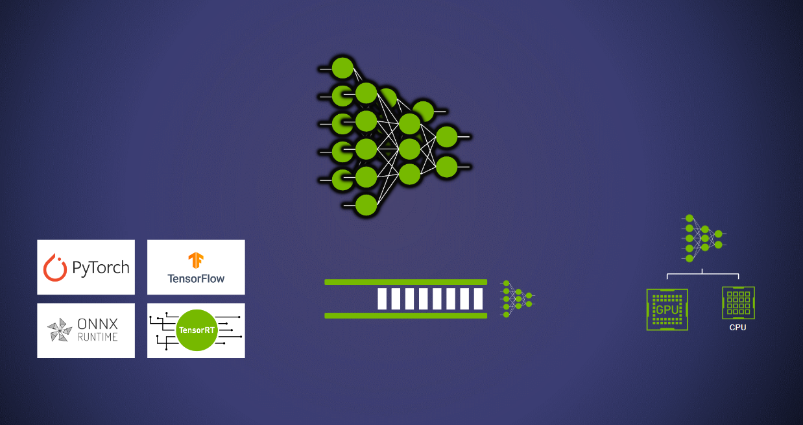

# Deploy models using Triton

Any deep learning inference serving solution needs to tackle two fundamental challenges:
* Managing multiple models.
* Versioning, loading, and unloading models.

## Managing multiple models

The key challenge around managing multiple models is to build an infrastructure that can cater to the different requirements of different models. For instance, users may need to deploy a PyTorch model and TensorFlow model on the same server, and they have different loads for both the models, need to run them on different hardware devices, and need to independently manage the serving configurations (model queues, versions, caching, acceleration, and more). The Triton Inference Server caters to all of the above and more. 



The first step in deploying models using the Triton Inference Server is building a repository that houses the models which will be served and the configuration schema. For the purposes of this demonstration, we will be making use of an [EAST](https://arxiv.org/pdf/1704.03155v2.pdf) model to detect text and a text recognition model. This workflow is largely an adaptation of [OpenCV's Text Detection](https://docs.opencv.org/4.x/db/da4/samples_2dnn_2text_detection_8cpp-example.html) samples.

### Getting access to the models

First, clone the repository and navigate to this folder.
```
cd server/docs/examples/basic_conceptual_guide/Part_1-model_deployment
```

#### Text Detection
Download and unzip OpenCV's EAST model.
```
wget https://www.dropbox.com/s/r2ingd0l3zt8hxs/frozen_east_text_detection.tar.gz
tar -xvf frozen_east_text_detection.tar.gz
```

Export to ONNX. The [NGC TensorFlow 2 container](https://catalog.ngc.nvidia.com/orgs/nvidia/containers/tensorflow) can also be used as an environment.
```
pip install tensorflow
pip install -U tf2onnx
python -m tf2onnx.convert --input frozen_east_text_detection.pb --inputs "input_images:0" --outputs "feature_fusion/Conv_7/Sigmoid:0","feature_fusion/concat_3:0" --output model.onnx
```

#### Text Recognition
Download the Text Recognition model weights. Use the [NGC PyTorch container](https://catalog.ngc.nvidia.com/orgs/nvidia/containers/pytorch) as the environment for the following.

```
docker run -it --gpus all -v ${PWD}:/scratch nvcr.io/nvidia/pytorch:<yy.mm>-py3
cd /scratch
wget https://www.dropbox.com/sh/j3xmli4di1zuv3s/AABzCC1KGbIRe2wRwa3diWKwa/None-ResNet-None-CTC.pth
```

Export the models as `.onnx` using the file in the `utils` folder. This file is adapted from [Baek et. al. 2019](https://github.com/clovaai/deep-text-recognition-benchmark).
```
import torch
from utils.model import STRModel

# Create PyTorch Model Object
model = STRModel(input_channels=1, output_channels=512, num_classes=37)

# Load model weights from external file
state = torch.load("None-ResNet-None-CTC.pth")
state = {key.replace("module.", ""): value for key, value in state.items()}
model.load_state_dict(state)

# Create ONNX file by tracing model
trace_input = torch.randn(1, 1, 32, 100)
torch.onnx.export(model, trace_input, "str.onnx", verbose=True)
```

### Setting up the model repository

A model repository is Triton's way of reading your models and any associated metadata with each model (configurations, version files, etc.). While a server can use one or more model repositories for simplicity, this explanation only uses a single repository. It is a folder in your filesystem that contains models in this format:
```
<model-repository>/
  <model-name>/
    [config.pbtxt]
    [<output-labels-file> ...]
    <version>/
      <model-definition-file>
    <version>/
      <model-definition-file>
    ...
  <model-name>/
    [config.pbtxt]
    [<output-labels-file> ...]
    <version>/
      <model-definition-file>
    <version>/
      <model-definition-file>
    ...
  ...
```

There are three important components to be discussed from the above structure:
* `model name`: The identifying name for the model.
* `config.pbtxt`: For each model, users can define a model configuration. This configuration, at minimum, needs to define: the backend, name, shape, and datatype of model inputs and outputs. For most of the popular backends, this configuration file is autogenerated with defaults. Explore the [common protobuf](https://github.com/triton-inference-server/common/blob/main/protobuf/model_config.proto) for the full specification of the configuration file.
* `version`: versioning makes multiple versions of the same model available for use depending on the policy selected. [More Information about versioning.](https://github.com/triton-inference-server/server/blob/main/docs/user_guide/model_configuration.md#version-policy)

For this example the model repository structure would need to be set up in the following manner:
```
model_repository
|
|-- text_detection
|   |
|   |-- config.pbtxt
|   |-- 1
|       |
|       |-- model.onnx
|
|-- text_recognition
    |
    |-- config.pbtxt
    |-- 1
        |
        |-- model.onnx
```

With the models and the file structure ready, the only point of discussion remaining are the `config.pbtxt` files. As an example, consider the model configuration for the `EAST text detection` model. This is an ONNX model that has one `input` and two `output` layers.

```
name: "text_detection"
backend: "onnxruntime"
max_batch_size : 256
input [
  {
    name: "input_images:0"
    data_type: TYPE_FP32
    dims: [ -1, -1, -1, 3 ]
  }
]
output [
  {
    name: "feature_fusion/Conv_7/Sigmoid:0"
    data_type: TYPE_FP32
    dims: [ -1, -1, -1, 1 ]
  }
]
output [
  {
    name: "feature_fusion/concat_3:0"
    data_type: TYPE_FP32
    dims: [ -1, -1, -1, 5 ]
  }
]
```
* **name:** "name" is an optional field, the value of which should match the name of the directory of the model.
* **backend:** This field indicates which backend is being used to run the model. Triton supports a wide variety of backends like TensorFlow, PyTorch, Python, ONNX and more. For a complete list of field selection refer to [these comments](https://github.com/triton-inference-server/backend#backends). 
* **max_batch_size:** As the name implies, this field defines the maximum batch size that the model can support.
* **input and output layers**: The input and output layers specify the name, shape, datatype, and more, while providing operations like [reshaping](https://github.com/triton-inference-server/server/blob/main/docs/user_guide/model_configuration.md#reshape) and support for [ragged batches](https://github.com/triton-inference-server/server/blob/main/docs/user_guide/ragged_batching.md#ragged-batching).

For an expansive coverage of all possible fields and their values, refer to the [model config protobuf](https://github.com/triton-inference-server/common/blob/main/protobuf/model_config.proto).

**Note:** The model repository can be set up in a local filesystem or a file system on a cloud service like AWS, GCP or Azure. Refer to [this guide](https://github.com/triton-inference-server/server/blob/main/docs/model_repository.md#model-repository-locations) for more information.


### Launching the server

The next step is to launch the server. While the Triton Inference Server can be [built from source](https://github.com/triton-inference-server/server/blob/main/docs/build.md), the use of [pre-built Docker containers](https://catalog.ngc.nvidia.com/orgs/nvidia/containers/tritonserver) freely available from NGC is highly recommended for this example. You may need to create an account and get the API key from [here](https://ngc.nvidia.com/setup/). Sign up and login with your key (follow the instructions [here](https://ngc.nvidia.com/setup/api-key) after signing up).

```
cd /path/to/model/repository

# Replace the yy.mm in the image name with the release year and month
# of the Triton version needed, eg. 22.08

docker run --gpus=all -it --shm-size=256m --rm -p8000:8000 -p8001:8001 -p8002:8002 -v$(pwd):/workspace/ -v/$(pwd)/model_repository:/models nvcr.io/nvidia/tritonserver:<yy.mm>-py3 bash
```

Once Triton Inference Server has been built or once inside the container, it can be launched with the command:
```
tritonserver --model-repository=/models
```
This will spin up the server and model instances will be ready for inference.

```
I0712 16:37:18.246487 128 server.cc:626]
+------------------+---------+--------+
| Model            | Version | Status |
+------------------+---------+--------+
| text_detection   | 1       | READY  |
| text_recognition | 1       | READY  |
+------------------+---------+--------+

I0712 16:37:18.267625 128 metrics.cc:650] Collecting metrics for GPU 0: NVIDIA GeForce RTX 3090
I0712 16:37:18.268041 128 tritonserver.cc:2159]
+----------------------------------+----------------------------------------------------------------------------------------------------------------------------------------------------------------------------------------------+
| Option                           | Value                                                                                                                                                                                        |
+----------------------------------+----------------------------------------------------------------------------------------------------------------------------------------------------------------------------------------------+
| server_id                        | triton                                                                                                                                                                                       |
| server_version                   | 2.23.0                                                                                                                                                                                       |
| server_extensions                | classification sequence model_repository model_repository(unload_dependents) schedule_policy model_configuration system_shared_memory cuda_shared_memory binary_tensor_data statistics trace |
| model_repository_path[0]         | /models                                                                                                                                                                                      |
| model_control_mode               | MODE_NONE                                                                                                                                                                                    |
| strict_model_config              | 1                                                                                                                                                                                            |
| rate_limit                       | OFF                                                                                                                                                                                          |
| pinned_memory_pool_byte_size     | 268435456                                                                                                                                                                                    |
| cuda_memory_pool_byte_size{0}    | 67108864                                                                                                                                                                                     |
| response_cache_byte_size         | 0                                                                                                                                                                                            |
| min_supported_compute_capability | 6.0                                                                                                                                                                                          |
| strict_readiness                 | 1                                                                                                                                                                                            |
| exit_timeout                     | 30                                                                                                                                                                                           |
+----------------------------------+----------------------------------------------------------------------------------------------------------------------------------------------------------------------------------------------+

I0712 16:37:18.269464 128 grpc_server.cc:4587] Started GRPCInferenceService at 0.0.0.0:8001
I0712 16:37:18.269956 128 http_server.cc:3303] Started HTTPService at 0.0.0.0:8000
I0712 16:37:18.311686 128 http_server.cc:178] Started Metrics Service at 0.0.0.0:8002
```

### Building a client application

There are three ways to interact with the Triton Inference Server:
* HTTPS API
* gRPC API
* Native C API

The HTTP and gRPC API is available in C++, Python, Java, and Javascript. This example contains two Python client scripts, one for each model. Refer to the Triton Inference Server "Client" [repository](https://github.com/triton-inference-server/client) for more information. Before diving into the usage of the client, a discussion about key components required is important.

Building a client requires three basic steps:
* Firstly, we set up a connection with the Triton Inference Server.
```
client = httpclient.InferenceServerClient(url="localhost:8000")
```
* Secondly, we specify the names of the input and output layer(s) of our model.
```
# Input
input_image = httpclient.InferInput("input_images:0", blob.shape, datatype="FP32")

# Output
scores = httpclient.InferRequestedOutput("feature_fusion/Conv_7/Sigmoid:0", binary_data=True)
geometry = httpclient.InferRequestedOutput("feature_fusion/concat_3:0", binary_data=True)
```
* Lastly, we send an inference request to the Triton Inference Server
```
query = client.infer(model_name="text_detection", inputs=[input_image], outputs=[scores, geometry])
```

With the fundamentals discussed, we proceed to running the two client scripts. Let's use the Triton Container.
```
cd path/to/client/folder
docker run -it --net=host -v ${PWD}:/workspace/ nvcr.io/nvidia/tritonserver:<yy:mm>-py3-sdk bash
```
Next, install the additional dependencies.
```
# Install OpenCV
apt-get update
apt-get install ffmpeg libsm6 libxext6 -y
pip install opencv-python
```

Lastly, download an image and query the models using the client scripts.
```
# get a sample image for query
wget dynl.mktgcdn.com/p/qoqGB99OIr5Qr_ebFF-Vil_F2_DKjYUSCL5OuuH9g80/600x449.jpg -O img1.jpg
python3 client.py
python3 client2.py
```

`client.py` will yield cropped images of text blobs which were present in the downloaded image. `client2.py` uses one of these images and outputs the text. These scripts contain pre/post processing elements for the models used. Part 5 of this tutorial series touches on moving these steps to the server.

## Model Versioning

The ability to deploy different versions of a model is essential to building an MLOps pipeline. The need arises from use cases like conducting A/B tests, easy model version rollbacks and more. Triton users can add a folder and the new model in the same repository:
```
model_repository
|
|-- text_detection
|   |
|   |-- config.pbtxt
|   |-- 1
|   |   |
|   |   |-- model.onnx
|   |-- 2
|   |   |
|   |-- |-- model.onnx
|
|-- text_recognition
    |
    |-- config.pbtxt
    |-- 1
        |
        |-- model.onnx
```
By default Triton serves the "latest" model, but the policy to serve different versions of the model is customizable. For more information, [refer this guide](https://github.com/triton-inference-server/server/blob/main/docs/user_guide/model_configuration.md#version-policy). 

## Loading & Unloading Models

Triton has model management API that can be used to control the model loading unloading policies. This API is extremely useful in cases where one or more models need to be loaded or unloaded without interrupting inference for other models being served on the same server. Users can select from one of three control modes:
* NONE
* EXPLICIT
* POLL
```
tritonserver --model-repository=/models --model-control-mode=poll
```
The policies can also be set via command line arguments whilst launching the server. For more information, refer [this section](https://github.com/triton-inference-server/server/blob/main/docs/user_guide/model_management.md#model-management) of the documentation.

# What's next?

In this tutorial, we covered the very basics of setting up and querying a Triton Inference Server. This is Part 1 of a 5 part tutorial series that covers the challenges faced in deploying Deep Learning models to production. Part 2 covers `Concurrent Model Execution and Dynamic Batching`. Depending on your workload and experience you might want to jump to Part 5 with covers `Building an Ensemble Pipeline with multiple models, pre and post processing steps, and adding business logic`.


