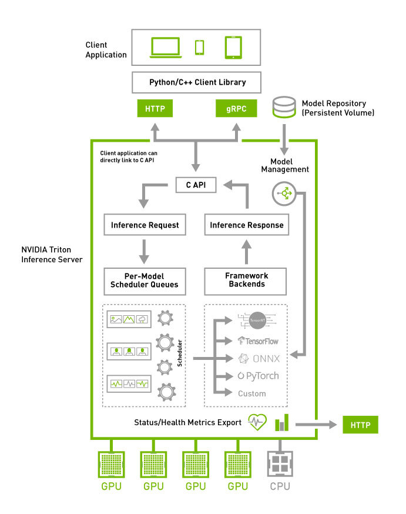

# Customizing deployment with Model Analyzer

Every inference deployment has its unique set of challenges. These challenges may arise from Service Level Agreements about maintaining latency, limited hardware resources, unique requirements of individual models, the nature and the volume of requests, or something completely different. Additionally, the Triton Inference Server has many features which can be leveraged be make tradeoffs between memory consumption and performance. 

With the sheer number of features and requirements, finding an optimal configuration for each deployment becomes a task for "Sweeping" through each of the possible configurations to measure performance. This discussion covers:
* Performance Discussion
* Using Model Analyzer to find optimal configuration

## Performance Discussion

Measuring performance for an inference serving architecture is a fairly complex problem on it. This complexity arises from the fact that "running inference" is just one piece of the puzzle. To understand this, let's walk through how the Triton Inference Server would process a query with dynamic batching is enabled and multiple model instances being used. 



Once a query is sent from the client, Triton's handler enqueues it in the requested model's queue. Once one of the model instances is freed up, a dynamic batch of size corresponding to the preferred batch size is formed using the queries other incoming queries or queries which are already in the queue. This batch is then converted to the format required by the framework and sent to the Framework runtimes (PyTorch, TensorFlow, TensorRT, etc.). Post inference, these results are returned to the client.

In this process, there are three major contributors of latency:
* Network Latency
* Inference Compute time
* Latency caused due to wait time in the model's queue

Minimizing **Network latency** is a case by case process. For instance, let's consider computer vision models. These models use image frames, videos and 3D data like point clouds which can be quite large in size, thus requiring higher bandwidth to move. Most images are saved in float32 format, which can be converted to float16 format. This may affect the dynamic range in the image, which may or may not affect model performance based preprocessing steps taken while training the model but can definitely reduce the latency as less data needs to be transmitted.

Accelerating models to trim down the effective **compute time** is commonly achieved with a plethora of techniques like: optimizing the network graphs by fusing layers, reducing models precision, fusing kernels and more! This topic is covered in much more depth in Part 4 of this series.

Latency in **queues** can primarily be addressed by adding more instances of the model. This may or may not require additional resources based on the GPU utilization of the current number of instances. This is the core utilization problem that needs to be solved specifically for each deployment environment. To streamline this experience, Triton Inference Server comes with Model Analyzer.

Model Analyzer is a CLI tool to help with a better understanding of the compute and memory requirements of the Triton Inference Server models by sweeping through configurations settings and generating reports summarizing performance.

With Model Analyzer users can: 
* Run customizable configuration sweeps can be done to identify the best possible configuration for the expected workload and hardware. 
* Summarize findings about latency, throughput, GPU resource utilizations, power draw and more, with detailed reports, metrics and graphs. These reports help compare performance across different configurations of setup.
* Tailor model deployments to cater to user's Quality of Service requirements like specific p99 latency limits, GPU memory utilization and more!

## Using Model Analyzer
 
### Pre-requisites

Refer to Part 2 of this series to get access to the models. Refer to the Model Analyzer [installation guide](https://github.com/triton-inference-server/model_analyzer/blob/main/docs/install.md#recommended-installation-method) for more information about installing Model Analyzer. For ease of following along, use these commands to install model analyzer:

```
sudo apt-get update && sudo apt-get install python3-pip
sudo apt-get update && sudo apt-get install wkhtmltopdf
pip3 install triton-model-analyzer
```

### Usage details

Before diving into details with an example, a discussion about the overall functionality and capability is needed to understand how best to use the Model Analyzer tool. Let's begin the discussion by focusing on what is most important to the users: setting `objectives` and `constraints` for the sweeps.

- **objectives**: Users can choose to order the results on the basis of their deployment goals, throughput, latency, or tailoring to specific resource constraints. [Learn more](https://github.com/triton-inference-server/model_analyzer/blob/main/docs/config.md#objective).
    
    Model Analyzer has two modes, Online and Offline. In online mode users can specify latency budgets for their deployments to cater to their requirements. For Offline mode a similar specification can be mode for minimum throughput. [Learn more](https://github.com/triton-inference-server/model_analyzer/blob/main/docs/cli.md#model-analyze-modes)

- **constraints**: Users can also choose to constrain the selection of sweeps to specific requirements for throughput, latency or gpu memory utilization. [Learn more](https://github.com/triton-inference-server/model_analyzer/blob/main/docs/config.md#constraint)

With the more broader selections discussed, let's talk about the three key sub commands that users need to use to make use of Model Analyzer: `profile`, `analyze`, and `report`. While most of the settings for these commands can be set using a flag, some require building a configuration file. Refer to [this section](https://github.com/triton-inference-server/model_analyzer/blob/main/docs/config.md) of the documentation for a comprehensive list of settings.

- **profile**: `profile` is used to run the benchmarking sweeps. This is where users specify the sweep space details like number of instances per GPU, range of maximum batch sizes for the model, maximum cpu utilization, batch sizes of the queries sent, number of concurrent queries sent to Triton and [more](https://github.com/triton-inference-server/model_analyzer/blob/main/docs/config.md#config-options-for-profile). `profile` runs these sweeps, records the performance of each of the configurations and saves runs are checkpoints. Think of this step as simply running a large number of experiments and recording data points for analysis. This step will take 60-90 minutes to run. Refer to the [documentation](https://github.com/triton-inference-server/model_analyzer/blob/main/docs/config.md#config-options-for-profile) for more information or if you want a quicker and smaller sweep. 

- **analyze**: The `analyze` subcommand generates a report which summarizes the performance of the top 3 configurations in the sweep. This summary contains the following:
  - A Throughput vs Latency Plot comparing the same across the top 3 configs and the default configuration selected by the user.
  - A GPU Memory vs Latency Plot comparing the same across the top 3 configs and the default configuration selected by the user.
  - A table containing high level details about the top 3 configs and the default configuration selected by the user.

  While results from this summary can directly be utilized to pick the most relevant config for Triton but to obtain more details about each run, we need to use the `report` subcommand.

- **report**: The `report` subcommand generates detailed reports of the top 3 configurations presented in the summary generated by the Model Analyzer. It contains:
  - A chart outlining throughput and latency across an increasing number of concurrent requests sent to the server
  - A GPU Memory VS Latency and GPU Utilization vs Latency chart
  - A table outlining p99 latency, various components of latency, throughput, GPU Utilization and GPU memory utilization across for up to the maximum number of concurrent request selected in the profiling step (default is 1024)

These selections will be more tangible after observing an example in the next section.

### Example

Consider the deployment of the text recognition model with a latency budget of `10 ms`. The first step is to profile the model. This command initiates a sweeping run and records performance.

`model-analyzer profile --model-repository /path/to/model/repository --profile-models <name of the model> --triton-launch-mode=<launch mode: local/docker etc> --output-model-repository-path /path/to/output -f <path to config file>`

Note: The config file contains the shape of the query image. Refer the Launch mode [documentation](https://github.com/triton-inference-server/model_analyzer/blob/main/docs/launch_modes.md) for more info about the launch mode flag.

```
model-analyzer profile --model-repository /workspace/model_repository --profile-models text_recognition --triton-launch-mode=local --output-model-repository-path /workspace/output/ -f perf.yaml --override-output-model-repository --latency-budget 10
```

Once the sweeps are done users can then use `report` to summarize the top 3 configurations.

```
model-analyzer report --report-model-configs text_recognition_config_4,text_recognition_config_5,text_recognition_config_6 --export-path /workspace --config-file perf.yaml
```

There are two types of reports which are generated:
* Summaries
* Detailed Reports

**Summaries** contain an overall results of all the three best configurations. It has information about the hardware being used, the throughput vs latency curve, the GPU Memory vs latency curve and a table with performance numbers and other key information. By default, the sweep space is limited to a certain number of popular features like dynamic batching and multiple model instances, but users can expand the space with [model config parameters](https://github.com/triton-inference-server/model_analyzer/blob/main/docs/config.md#model-config-parameters) to any features which can be specified in Triton's configuration files. 


**Detailed Reports** breakdown the performance of each of the configurations. They contain more detailed performance charts describing the performance numbers for different loads.


Sample reports can be found in the `reports` folder.

# What's next?

In this tutorial, we covered the use of Model Analyzer, which is a tool to select the best possible deployment configuration with respect to resource utilization. This is Part 3 of a 5 part tutorial series which covers the challenges faced in deploying Deep Learning models to production. Part 2 covers `Inference Accelerations`, which will talk about framework level optimizations to accelerate your models!
