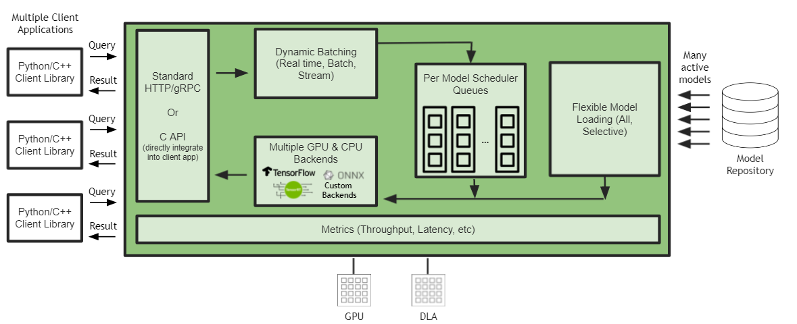

<!--
# Copyright 2021, NVIDIA CORPORATION & AFFILIATES. All rights reserved.
#
# Redistribution and use in source and binary forms, with or without
# modification, are permitted provided that the following conditions
# are met:
#  * Redistributions of source code must retain the above copyright
#    notice, this list of conditions and the following disclaimer.
#  * Redistributions in binary form must reproduce the above copyright
#    notice, this list of conditions and the following disclaimer in the
#    documentation and/or other materials provided with the distribution.
#  * Neither the name of NVIDIA CORPORATION nor the names of its
#    contributors may be used to endorse or promote products derived
#    from this software without specific prior written permission.
#
# THIS SOFTWARE IS PROVIDED BY THE COPYRIGHT HOLDERS ``AS IS'' AND ANY
# EXPRESS OR IMPLIED WARRANTIES, INCLUDING, BUT NOT LIMITED TO, THE
# IMPLIED WARRANTIES OF MERCHANTABILITY AND FITNESS FOR A PARTICULAR
# PURPOSE ARE DISCLAIMED.  IN NO EVENT SHALL THE COPYRIGHT OWNER OR
# CONTRIBUTORS BE LIABLE FOR ANY DIRECT, INDIRECT, INCIDENTAL, SPECIAL,
# EXEMPLARY, OR CONSEQUENTIAL DAMAGES (INCLUDING, BUT NOT LIMITED TO,
# PROCUREMENT OF SUBSTITUTE GOODS OR SERVICES; LOSS OF USE, DATA, OR
# PROFITS; OR BUSINESS INTERRUPTION) HOWEVER CAUSED AND ON ANY THEORY
# OF LIABILITY, WHETHER IN CONTRACT, STRICT LIABILITY, OR TORT
# (INCLUDING NEGLIGENCE OR OTHERWISE) ARISING IN ANY WAY OUT OF THE USE
# OF THIS SOFTWARE, EVEN IF ADVISED OF THE POSSIBILITY OF SUCH DAMAGE.
-->

# Triton Inference Server Support for Jetson and JetPack

Triton Inference Server is officially supported on JetPack starting from JetPack 4.6. Triton Inference Server on Jetson supports trained AI models from multiple frameworks includings NVIDIA TensorRT, TensorFlow and ONNX Runtime.

On JetPack, although HTTP/REST and GRPC inference protocols are supported, for edge use cases, direct [C API integration](inference_protocols.md#c-api) is recommended.



Triton Inference Server support on JetPack includes:

* Running models on GPU and NVDLA
* Support for multiple frameworks: TensorRT, TensorFlow and ONNX Runtime.
* [Concurrent model execution](architecture.md#concurrent-model-execution)
* [Dynamic batching](architecture.md#models-and-schedulers)
* [Model pipelines](architecture.md#ensemble-models)
* [Extensible backends](https://github.com/triton-inference-server/backend)
* [HTTP/REST and GRPC inference protocols](inference_protocols.md)
* [C API](inference_protocols.md#c-api)

You can download the `.tar` files for Jetson published on the Triton Infence Server [release page](https://github.com/triton-inference-server/server/releases) in _"Jetson JetPack Support"_ section. The `.tar` file contains the Triton executables and shared libraries, as well as the C++ and Python client libraries and examples.

Note that [perf_analyzer](perf_analyzer.md) is supported on Jetson, while the [model_analyzer](model_analyzer.md) is currently not available for Jetson. To execute `perf_analyzer` for C API, include the option `--service-kind=triton_c_api`: 

```shell
perf_analyzer -m graphdef_int32_int32_int32 --service-kind=triton_c_api --triton-server-directory=/opt/tritonserver --model-repository=/workspace/qa/L0_perf_analyzer_capi/models
```
