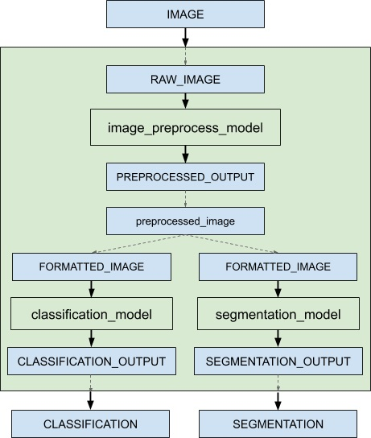

<!--
# Copyright 2018-2025, NVIDIA CORPORATION & AFFILIATES. All rights reserved.
#
# Redistribution and use in source and binary forms, with or without
# modification, are permitted provided that the following conditions
# are met:
#  * Redistributions of source code must retain the above copyright
#    notice, this list of conditions and the following disclaimer.
#  * Redistributions in binary form must reproduce the above copyright
#    notice, this list of conditions and the following disclaimer in the
#    documentation and/or other materials provided with the distribution.
#  * Neither the name of NVIDIA CORPORATION nor the names of its
#    contributors may be used to endorse or promote products derived
#    from this software without specific prior written permission.
#
# THIS SOFTWARE IS PROVIDED BY THE COPYRIGHT HOLDERS ``AS IS'' AND ANY
# EXPRESS OR IMPLIED WARRANTIES, INCLUDING, BUT NOT LIMITED TO, THE
# IMPLIED WARRANTIES OF MERCHANTABILITY AND FITNESS FOR A PARTICULAR
# PURPOSE ARE DISCLAIMED.  IN NO EVENT SHALL THE COPYRIGHT OWNER OR
# CONTRIBUTORS BE LIABLE FOR ANY DIRECT, INDIRECT, INCIDENTAL, SPECIAL,
# EXEMPLARY, OR CONSEQUENTIAL DAMAGES (INCLUDING, BUT NOT LIMITED TO,
# PROCUREMENT OF SUBSTITUTE GOODS OR SERVICES; LOSS OF USE, DATA, OR
# PROFITS; OR BUSINESS INTERRUPTION) HOWEVER CAUSED AND ON ANY THEORY
# OF LIABILITY, WHETHER IN CONTRACT, STRICT LIABILITY, OR TORT
# (INCLUDING NEGLIGENCE OR OTHERWISE) ARISING IN ANY WAY OUT OF THE USE
# OF THIS SOFTWARE, EVEN IF ADVISED OF THE POSSIBILITY OF SUCH DAMAGE.
-->

# Ensemble Models

An ensemble model represents a *pipeline* of one or more models and
the connection of input and output tensors between those
models. Ensemble models are intended to be used to encapsulate a
procedure that involves multiple models, such as "data preprocessing
-> inference -> data postprocessing".  Using ensemble models for this
purpose can avoid the overhead of transferring intermediate tensors
and minimize the number of requests that must be sent to Triton.

The ensemble scheduler must be used for ensemble models, regardless of
the scheduler used by the models within the ensemble. With respect to
the ensemble scheduler, an *ensemble* model is not an actual
model. Instead, it specifies the dataflow between models within the
ensemble as *ModelEnsembling::Step* entries in the model
configuration. The scheduler collects the output tensors in each step,
provides them as input tensors for other steps according to the
specification. In spite of that, the ensemble model is still viewed as
a single model from an external view.

Note that the ensemble models will inherit the characteristics of the
models involved, so the meta-data in the request header must comply
with the models within the ensemble. For instance, if one of the
models is stateful model, then the inference request for the ensemble
model should contain the information mentioned in [Stateful
Models](architecture.md#stateful-models), which will be provided to the stateful
model by the scheduler.

As an example consider an ensemble model for image classification and
segmentation that has the following model configuration:

```
name: "ensemble_model"
platform: "ensemble"
max_batch_size: 1
input [
  {
    name: "IMAGE"
    data_type: TYPE_STRING
    dims: [ 1 ]
  }
]
output [
  {
    name: "CLASSIFICATION"
    data_type: TYPE_FP32
    dims: [ 1000 ]
  },
  {
    name: "SEGMENTATION"
    data_type: TYPE_FP32
    dims: [ 3, 224, 224 ]
  }
]
ensemble_scheduling {
  step [
    {
      model_name: "image_preprocess_model"
      model_version: -1
      input_map {
        key: "RAW_IMAGE"
        value: "IMAGE"
      }
      output_map {
        key: "PREPROCESSED_OUTPUT"
        value: "preprocessed_image"
      }
    },
    {
      model_name: "classification_model"
      model_version: -1
      input_map {
        key: "FORMATTED_IMAGE"
        value: "preprocessed_image"
      }
      output_map {
        key: "CLASSIFICATION_OUTPUT"
        value: "CLASSIFICATION"
      }
    },
    {
      model_name: "segmentation_model"
      model_version: -1
      input_map {
        key: "FORMATTED_IMAGE"
        value: "preprocessed_image"
      }
      output_map {
        key: "SEGMENTATION_OUTPUT"
        value: "SEGMENTATION"
      }
    }
  ]
}
```

The ensemble\_scheduling section indicates that the ensemble scheduler will be
used and that the ensemble model consists of three different models. Each
element in step section specifies the model to be used and how the inputs and
outputs of the model are mapped to tensor names recognized by the scheduler. For
example, the first element in step specifies that the latest version of
image\_preprocess\_model should be used, the content of its input "RAW\_IMAGE"
is provided by "IMAGE" tensor, and the content of its output
"PREPROCESSED\_OUTPUT" will be mapped to "preprocessed\_image" tensor for later
use. The tensor names recognized by the scheduler are the ensemble inputs, the
ensemble outputs and all values in the input\_map and the output\_map.

The models composing the ensemble may also have dynamic batching
enabled.  Since ensemble models are just routing the data between
composing models, Triton can take requests into an ensemble model
without modifying the ensemble's configuration to exploit the dynamic
batching of the composing models.

Assuming that only the ensemble model, the preprocess model, the classification
model and the segmentation model are being served, the client applications will
see them as four different models which can process requests independently.
However, the ensemble scheduler will view the ensemble model as the following.



When an inference request for the ensemble model is received, the ensemble
scheduler will:

1. Recognize that the "IMAGE" tensor in the request is mapped to input
   "RAW\_IMAGE" in the preprocess model.

2. Check models within the ensemble and send an internal request to the
   preprocess model because all the input tensors required are ready.

3. Recognize the completion of the internal request, collect the output
   tensor and map the content to "preprocessed\_image" which is an unique name
   known within the ensemble.

4. Map the newly collected tensor to inputs of the models within the ensemble.
   In this case, the inputs of "classification\_model" and "segmentation\_model"
   will be mapped and marked as ready.

5. Check models that require the newly collected tensor and send internal
   requests to models whose inputs are ready, the classification
   model and the segmentation model in this case. Note that the responses will
   be in arbitrary order depending on the load and computation time of
   individual models.

6. Repeat step 3-5 until no more internal requests should be sent, and then
   response to the inference request with the tensors mapped to the ensemble
   output names.

Unlike other models, ensemble models do not support "instance_group" field in
the model configuration. The reason is that the ensemble scheduler itself
is mainly an event-driven scheduler with very minimal overhead so its
almost never the bottleneck of the pipeline. The composing models
within the ensemble can be individually scaled up or down with their
respective `instance_group` settings. To optimize your model pipeline
performance, you can use
[Model Analyzer](https://github.com/triton-inference-server/model_analyzer)
to find the optimal model configurations.

## Managing Memory Usage in Ensemble Models

An *inflight request* refers to an intermediate request generated by an upstream model that is queued and held in memory until it is processed by a downstream model within an ensemble pipeline. When upstream models process requests significantly faster than downstream models, these in-flight requests can accumulate and potentially lead to unbounded memory growth. This problem occurs when there is a speed mismatch between different steps in the pipeline and is particularly common in *decoupled models* that produce multiple responses per request more quickly than downstream models can consume.

Consider an example ensemble model with two steps where the upstream model is 10× faster:
1. **Preprocessing model**: Produces 100 preprocessed requests/sec
2. **Inference model**: Consumes 10 requests/sec

Without backpressure, requests accumulate in the pipeline faster than they can be processed, eventually leading to out-of-memory errors.

The `max_inflight_requests` field in the ensemble configuration sets a limit on the number of concurrent inflight requests permitted at each ensemble step for a single inference request.
When this limit is reached, faster upstream models are paused (blocked) until downstream models finish processing, effectively preventing unbounded memory growth.

```
ensemble_scheduling {
  max_inflight_requests: 16

  step [
    {
      model_name: "dali_preprocess"
      model_version: -1
      input_map { key: "RAW_IMAGE", value: "IMAGE" }
      output_map { key: "PREPROCESSED_IMAGE", value: "preprocessed" }
    },
    {
      model_name: "onnx_inference"
      model_version: -1
      input_map { key: "INPUT", value: "preprocessed" }
      output_map { key: "OUTPUT", value: "RESULT" }
    }
  ]
}
```

**Configuration:**
* **`max_inflight_requests: 16`**: For each ensemble request (not globally), at most 16 requests from `dali_preprocess`
  can wait for `onnx_inference` to process. Once this per-step limit is reached, `dali_preprocess` is blocked until the downstream step completes a response.
* **Default (`0`)**: No limit - allows unlimited inflight requests (original behavior).

### When to Use This Feature

Use `max_inflight_requests` when your ensemble pipeline includes:
* **Streaming or decoupled models**: When models produce multiple responses per request more quickly than downstream steps can process them.
* **Memory constraints**: Risk of unbounded memory growth from accumulating requests.

### Choosing the Right Value

The optimal value depends on your specific deployment, including batch size, request rate, available memory, and throughput.

* **Too low**: The producer step is blocked too often, which underutilizes faster models.
* **Too high**: Memory usage increases, diminishing the effectiveness of backpressure.
* **Recommendation**: Start with a small value and adjust it based on memory usage and throughput monitoring.

### Performance Considerations

* **Zero overhead when disabled**: If `max_inflight_requests: 0` (default),
  no synchronization overhead is incurred.
* **Minimal overhead when enabled**: Uses a blocking/wakeup mechanism per ensemble step, where upstream models are paused ("blocked") when the inflight requests limit is reached and resumed ("woken up") as downstream models complete processing them. This synchronization ensures memory usage stays within bounds, though it may increase latency.

  **Note**: This blocking does not cancel or internally time out intermediate requests, but clients may experience increased end-to-end latency.

## Additional Resources

You can find additional end-to-end ensemble examples in the links below:
* [This guide](https://github.com/triton-inference-server/tutorials/tree/main/Conceptual_Guide/Part_5-Model_Ensembles)
explores the concept of ensembles with a running example.
* [Preprocessing in Python Backend Using
  Ensemble](https://github.com/triton-inference-server/python_backend#preprocessing)
* [Accelerating Inference with NVIDIA Triton Inference Server and NVIDIA
  DALI](https://developer.nvidia.com/blog/accelerating-inference-with-triton-inference-server-and-dali/)
* [Using RAPIDS AI with NVIDIA Triton Inference
  Server](https://github.com/rapidsai/rapids-examples/tree/main/rapids_triton_example)