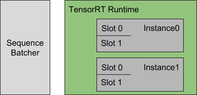
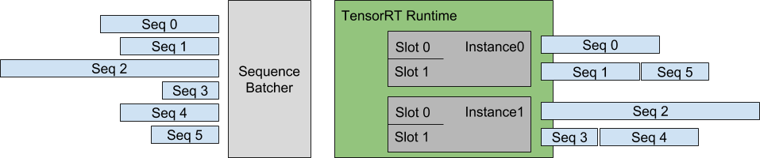
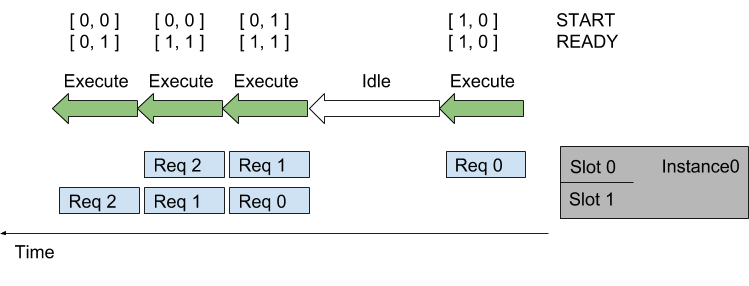
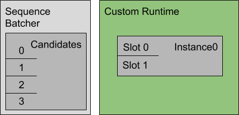
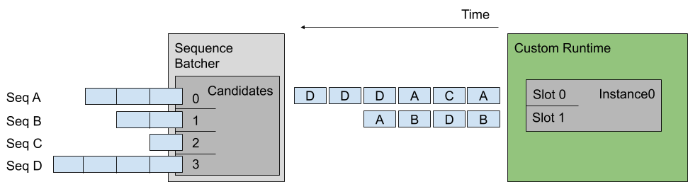

<!--
# Copyright 2018-2024, NVIDIA CORPORATION & AFFILIATES. All rights reserved.
#
# Redistribution and use in source and binary forms, with or without
# modification, are permitted provided that the following conditions
# are met:
#  * Redistributions of source code must retain the above copyright
#    notice, this list of conditions and the following disclaimer.
#  * Redistributions in binary form must reproduce the above copyright
#    notice, this list of conditions and the following disclaimer in the
#    documentation and/or other materials provided with the distribution.
#  * Neither the name of NVIDIA CORPORATION nor the names of its
#    contributors may be used to endorse or promote products derived
#    from this software without specific prior written permission.
#
# THIS SOFTWARE IS PROVIDED BY THE COPYRIGHT HOLDERS ``AS IS'' AND ANY
# EXPRESS OR IMPLIED WARRANTIES, INCLUDING, BUT NOT LIMITED TO, THE
# IMPLIED WARRANTIES OF MERCHANTABILITY AND FITNESS FOR A PARTICULAR
# PURPOSE ARE DISCLAIMED.  IN NO EVENT SHALL THE COPYRIGHT OWNER OR
# CONTRIBUTORS BE LIABLE FOR ANY DIRECT, INDIRECT, INCIDENTAL, SPECIAL,
# EXEMPLARY, OR CONSEQUENTIAL DAMAGES (INCLUDING, BUT NOT LIMITED TO,
# PROCUREMENT OF SUBSTITUTE GOODS OR SERVICES; LOSS OF USE, DATA, OR
# PROFITS; OR BUSINESS INTERRUPTION) HOWEVER CAUSED AND ON ANY THEORY
# OF LIABILITY, WHETHER IN CONTRACT, STRICT LIABILITY, OR TORT
# (INCLUDING NEGLIGENCE OR OTHERWISE) ARISING IN ANY WAY OUT OF THE USE
# OF THIS SOFTWARE, EVEN IF ADVISED OF THE POSSIBILITY OF SUCH DAMAGE.
-->

# Implicit State Management

Implicit state management allows a stateful model to store its state inside
Triton. When using implicit state, the stateful model does not need to store
the state required for inference inside the model.

Below is a portion of the model configuration that indicates the model
is using implicit state.

```
sequence_batching {
  state [
    {
      input_name: "INPUT_STATE"
      output_name: "OUTPUT_STATE"
      data_type: TYPE_INT32
      dims: [ -1 ]
    }
  ]
}
```

The *state* section in the sequence_batching setting is used to indicate that
the model is using implicit state. The *input_name* field specifies the name of
the input tensor that will contain the input state. The *output_name* field
describes the name of the output tensor produced by the model that contains
output state. The output state provided by the model in the *i<sup>th</sup>*
request in the sequence will be used as the input state in the
*i+1<sup>th</sup>* request. The *dims* field specifies the dimensions of the
state tensors. When the *dims* field contains variable-sized dimensions, the
shape of the input state and output state does not have to match.

For debugging purposes, the client can request the output state. In order to
allow the client to request the output state, the
[*output* section of the model configuration](./model_configuration.md#inputs-and-outputs)
must list the output state as one of the model outputs. Note that requesting the
output state from the client can increase the request latency because of the
additional tensors that have to be transferred.

Implicit state management requires backend support. Currently, only
[onnxruntime_backend](https://github.com/triton-inference-server/onnxruntime_backend)
[tensorrt_backend](https://github.com/triton-inference-server/tensorrt_backend),
and [pytorch_backend](https://github.com/triton-inference-server/pytorch_backend)
support implicit state.

## State Initialization

By default, the starting request in the sequence contains uninitialized data for
the input state. The model can use the start flag in the request to detect the
beginning of a new sequence and initialize the model state by providing the
initial state in the model output. If the *dims* section in the *state*
description of the model contains variable-sized dimensions, Triton will use *1*
for every variable-sized dimension for the starting request. For other
non-starting requests in the sequence, the input state is the output state of
the previous request in the sequence. For an example ONNX model that uses
implicit state you can refer to this onnx model generated from the
`create_onnx_modelfile_wo_initial_state()`
[from this generation script](https://github.com/triton-inference-server/server/blob/main/qa/common/gen_qa_implicit_models.py).
This is a simple accumulator model that stores the partial sum of the requests
in a sequence in Triton using implicit state. For state initialization, if the
request is starting, the model sets the "OUTPUT\_STATE" to be equal to the
"INPUT" tensor. For non-starting requests, it sets the "OUTPUT\_STATE" tensor
to the sum of "INPUT" and "INPUT\_STATE" tensors.

In addition to the default state initialization discussed above, Triton provides
two other mechanisms for initializing state.

### Initializing State from Zero.

Below is an example of initializing state from zero.

```
sequence_batching {
  state [
    {
      input_name: "INPUT_STATE"
      output_name: "OUTPUT_STATE"
      data_type: TYPE_INT32
      dims: [ -1 ]
      initial_state: {
       data_type: TYPE_INT32
       dims: [ 1 ]
       zero_data: true
       name: "initial state"
      }
    }
  ]
}
```

Note that in the example above variable dimensions in the state description are
converted to fixed size dimensions.

### Initializing State from File

For initializing state from file, you need to create a directory named
"initial\_state" under the model directory. The file that contains the initial
state under this directory needs to be provided in the *data_file* field.
The data stored in this file will be used in row-major order as the initial
state. Below is an example state description initializing state from file.

```
sequence_batching {
  state [
    {
      input_name: "INPUT_STATE"
      output_name: "OUTPUT_STATE"
      data_type: TYPE_INT32
      dims: [ -1 ]
      initial_state: {
       data_type: TYPE_INT32
       dims: [ 1 ]
       data_file: "initial_state_data"
       name: "initial state"
      }
    }
  ]
}
```

## Scheduling Strategies

The sequence batcher can employ one of two scheduling strategies when
deciding how to batch the sequences that are routed to the same model
instance. These strategies are [direct](#direct) and [oldest](#oldest).

### Direct

With the Direct scheduling strategy the sequence batcher ensures not
only that all inference requests in a sequence are routed to the same
model instance, but also that each sequence is routed to a dedicated
batch slot within the model instance. This strategy is required when
the model maintains state for each batch slot, and is expecting all
inference requests for a given sequence to be routed to the same slot
so that the state is correctly updated.

As an example of the sequence batcher using the Direct scheduling
strategy, assume a TensorRT stateful model that has the following
model configuration.

```
name: "direct_stateful_model"
platform: "tensorrt_plan"
max_batch_size: 2
sequence_batching {
  max_sequence_idle_microseconds: 5000000
  direct { }
  control_input [
    {
      name: "START"
      control [
        {
          kind: CONTROL_SEQUENCE_START
          fp32_false_true: [ 0, 1 ]
        }
      ]
    },
    {
      name: "READY"
      control [
        {
          kind: CONTROL_SEQUENCE_READY
          fp32_false_true: [ 0, 1 ]
        }
      ]
    }
  ]
}
input [
  {
    name: "INPUT"
    data_type: TYPE_FP32
    dims: [ 100, 100 ]
  }
]
output [
  {
    name: "OUTPUT"
    data_type: TYPE_FP32
    dims: [ 10 ]
  }
]
instance_group [
  {
    count: 2
  }
]
```

The sequence_batching section indicates that the model should use the
sequence batcher and the Direct scheduling strategy. In this example
the model only requires a *start* and *ready* control input from the
sequence batcher so only those controls are listed. The instance_group
indicates two instances of the model should be instantiated and
max_batch_size indicates that each of those instances should perform
batch-size 2 inferences. The following figure shows a representation
of the sequence batcher and the inference resources specified by this
configuration.



Each model instance is maintaining state for each batch slot, and is
expecting all inference requests for a given sequence to be routed to
the same slot so that the state is correctly updated. For this example
that means that Triton can simultaneously perform inference for up to
four sequences.

Using the Direct scheduling strategy, the sequence batcher:

* Recognizes when an inference request starts a new sequence and
  allocates a batch slot for that sequence. If no batch slot is
  available for the new sequence, Triton places the inference request
  in a backlog.

* Recognizes when an inference request is part of a sequence that has
  an allocated batch slot and routes the request to that slot.

* Recognizes when an inference request is part of a sequence that is
  in the backlog and places the request in the backlog.

* Recognizes when the last inference request in a sequence has been
  completed. The batch slot occupied by that sequence is immediately
  reallocated to a sequence in the backlog, or freed for a future
  sequence if there is no backlog.

The following figure shows how multiple sequences are scheduled onto
the model instances using the Direct scheduling strategy. On the left
the figure shows several sequences of requests arriving at
Triton. Each sequence could be made up of any number of inference
requests and those individual inference requests could arrive in any
order relative to inference requests in other sequences, except that
the execution order shown on the right assumes that the first
inference request of sequence 0 arrives before any inference request
in sequences 1-5, the first inference request of sequence 1 arrives
before any inference request in sequences 2-5, etc.

The right of the figure shows how the inference request sequences are
scheduled onto the model instances over time.



The following figure shows the sequence batcher uses the control input
tensors to communicate with the model. The figure shows two sequences
assigned to the two batch slots in a model instance. Inference
requests for each sequence arrive over time. The START and READY rows
show the input tensor values used for each execution of the
model. Over time the following happens:

* The first request arrives for the sequence in slot0. Assuming the
  model instance is not already executing an inference, the sequence
  scheduler immediately schedules the model instance to execute
  because an inference request is available.

* This is the first request in the sequence so the corresponding
  element in the START tensor is set to 1. There is no request
  available in slot1 so the READY tensor shows only slot0 as ready.

* After the inference completes the sequence scheduler sees that there
  are no requests available in any batch slot and so the model
  instance sits idle.

* Next, two inference requests arrive close together in time so that
  the sequence scheduler sees them both available in their respective
  batch slots. The scheduler immediately schedules the model instance
  to perform a batch-size 2 inference and uses START and READY to show
  that both slots have an inference request available but that only
  slot1 is the start of a new sequence.

* The processing continues in a similar manner for the other inference
  requests.



### Oldest

With the Oldest scheduling strategy the sequence batcher ensures that
all inference requests in a sequence are routed to the same model
instance and then uses the [dynamic
batcher](batcher.md#dynamic-batcher) to batch together
multiple inferences from different sequences into a batch that
inferences together.  With this strategy the model must typically use
the CONTROL_SEQUENCE_CORRID control so that it knows which sequence
each inference request in the batch belongs to. The
CONTROL_SEQUENCE_READY control is typically not needed because all
inferences in the batch will always be ready for inference.

As an example of the sequence batcher using the Oldest scheduling
strategy, assume a stateful model that has the following model
configuration:

```
name: "oldest_stateful_model"
platform: "tensorflow_savedmodel"
max_batch_size: 2
sequence_batching {
  max_sequence_idle_microseconds: 5000000
  oldest
    {
      max_candidate_sequences: 4
    }
  control_input [
    {
      name: "START"
      control [
        {
          kind: CONTROL_SEQUENCE_START
          fp32_false_true: [ 0, 1 ]
        }
      ]
    },
    {
      name: "END"
      control [
        {
          kind: CONTROL_SEQUENCE_END
          fp32_false_true: [ 0, 1 ]
        }
      ]
    },
    {
      name: "CORRID"
      control [
        {
          kind: CONTROL_SEQUENCE_CORRID
          data_type: TYPE_UINT64
        }
      ]
    }
  ]
}
input [
  {
    name: "INPUT"
    data_type: TYPE_FP32
    dims: [ 100, 100 ]
  }
]
output [
  {
    name: "OUTPUT"
    data_type: TYPE_FP32
    dims: [ 10 ]
  }
]
```

The sequence_batching section indicates that the model should use the
sequence batcher and the Oldest scheduling strategy. The Oldest
strategy is configured so that the sequence batcher maintains up to 4
active candidate sequences from which it prefers to form dynamic
batches of size 2. In this example the model requires a *start*,
*end*, and *correlation ID* control input from the sequence
batcher. The following figure shows a representation of the sequence
batcher and the inference resources specified by this configuration.



Using the Oldest scheduling strategy, the sequence batcher:

* Recognizes when an inference request starts a new sequence and
  attempts to find a model instance that has room for a candidate
  sequence. If no model instance has room for a new candidate
  sequence, Triton places the inference request in a backlog.

* Recognizes when an inference request is part of a sequence that is
  already a candidate sequence in some model instance and routes the
  request to that model instance.

* Recognizes when an inference request is part of a sequence that is
  in the backlog and places the request in the backlog.

* Recognizes when the last inference request in a sequence has been
  completed. The model instance immediately removes a sequence from
  the backlog and makes it a candidate sequence in the model instance,
  or records that the model instance can handle a future sequence if
  there is no backlog.

The following figure shows how multiple sequences are scheduled onto
the model instance specified by the above example configuration. On
the left the figure shows four sequences of requests arriving at
Triton. Each sequence is composed of multiple inference requests as
shown in the figure. The center of the figure shows how the inference
request sequences are batched onto the model instance over time,
assuming that the inference requests for each sequence arrive at the
same rate with sequence A arriving just before B, which arrives just
before C, etc. The Oldest strategy forms a dynamic batch from the
oldest requests but never includes more than one request from a given
sequence in a batch (for example, the last two inferences in sequence
D are not batched together).

