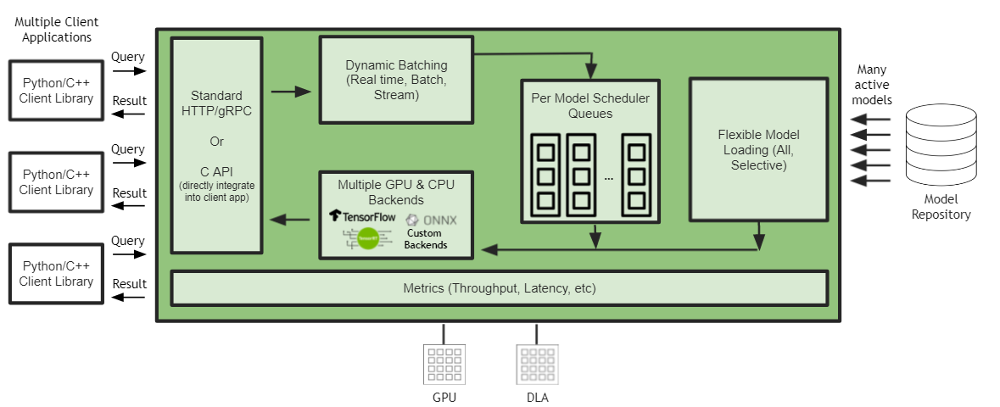

<!--
# Copyright 2021-2025, NVIDIA CORPORATION & AFFILIATES. All rights reserved.
#
# Redistribution and use in source and binary forms, with or without
# modification, are permitted provided that the following conditions
# are met:
#  * Redistributions of source code must retain the above copyright
#    notice, this list of conditions and the following disclaimer.
#  * Redistributions in binary form must reproduce the above copyright
#    notice, this list of conditions and the following disclaimer in the
#    documentation and/or other materials provided with the distribution.
#  * Neither the name of NVIDIA CORPORATION nor the names of its
#    contributors may be used to endorse or promote products derived
#    from this software without specific prior written permission.
#
# THIS SOFTWARE IS PROVIDED BY THE COPYRIGHT HOLDERS ``AS IS'' AND ANY
# EXPRESS OR IMPLIED WARRANTIES, INCLUDING, BUT NOT LIMITED TO, THE
# IMPLIED WARRANTIES OF MERCHANTABILITY AND FITNESS FOR A PARTICULAR
# PURPOSE ARE DISCLAIMED.  IN NO EVENT SHALL THE COPYRIGHT OWNER OR
# CONTRIBUTORS BE LIABLE FOR ANY DIRECT, INDIRECT, INCIDENTAL, SPECIAL,
# EXEMPLARY, OR CONSEQUENTIAL DAMAGES (INCLUDING, BUT NOT LIMITED TO,
# PROCUREMENT OF SUBSTITUTE GOODS OR SERVICES; LOSS OF USE, DATA, OR
# PROFITS; OR BUSINESS INTERRUPTION) HOWEVER CAUSED AND ON ANY THEORY
# OF LIABILITY, WHETHER IN CONTRACT, STRICT LIABILITY, OR TORT
# (INCLUDING NEGLIGENCE OR OTHERWISE) ARISING IN ANY WAY OUT OF THE USE
# OF THIS SOFTWARE, EVEN IF ADVISED OF THE POSSIBILITY OF SUCH DAMAGE.
-->

# Triton Inference Server Support for Jetson and JetPack

A release of Triton for [JetPack 5.0](https://developer.nvidia.com/embedded/jetpack)
is provided in the attached tar file in the [release notes](https://github.com/triton-inference-server/server/releases).



Triton Inference Server support on JetPack includes:

* Running models on GPU and NVDLA
* [Concurrent model execution](architecture.md#concurrent-model-execution)
* [Dynamic batching](architecture.md#models-and-schedulers)
* [Model pipelines](architecture.md#ensemble-models)
* [Extensible backends](https://github.com/triton-inference-server/backend)
* [HTTP/REST and GRPC inference protocols](../customization_guide/inference_protocols.md)
* [C API](../customization_guide/inference_protocols.md#in-process-triton-server-api)

Limitations on JetPack 5.0:

* Onnx Runtime backend does not support the OpenVino and TensorRT execution providers.
The CUDA execution provider is in Beta.
* The Python backend does not support GPU Tensors and Async BLS.
* CUDA IPC (shared memory) is not supported. System shared memory however is supported.
* GPU metrics, GCS storage, S3 storage and Azure storage are not supported.

On JetPack, although HTTP/REST and GRPC inference protocols are supported, for edge
use cases, direct [C API integration](../customization_guide/inference_protocols.md#in-process-triton-server-api)
is recommended.

You can download the `.tgz` file for Jetson from the Triton Inference Server
[release page](https://github.com/triton-inference-server/server/releases) in the
_"Jetson JetPack Support"_ section.

The `.tgz` file contains the Triton server executable and shared libraries,
as well as the C++ and Python client libraries and examples.

## Installation and Usage

### Build Dependencies for Triton

The following dependencies must be installed before building Triton server:

```
apt-get update && \
        apt-get install -y --no-install-recommends \
            software-properties-common \
            autoconf \
            automake \
            build-essential \
            git \
            libb64-dev \
            libre2-dev \
            libssl-dev \
            libtool \
            libboost-dev \
            rapidjson-dev \
            pkg-config \
            libopenblas-dev \
            libarchive-dev \
            zlib1g-dev \
            python3 \
            python3-dev \
            python3-pip
```

Additional Onnx Runtime dependencies must be installed to build the Onnx Runtime backend:

```
pip3 install --upgrade flake8 flatbuffers patchelf==0.17.2
```

Additional PyTorch dependencies must be installed to build (and run) the PyTorch backend:

```
apt-get -y install autoconf \
            bc \
            g++-8 \
            gcc-8 \
            clang-8 \
            lld-8

pip3 install --upgrade expecttest xmlrunner hypothesis aiohttp pyyaml scipy ninja typing_extensions protobuf
```

Apart from these PyTorch dependencies, the PyTorch wheel corresponding to the release must also be installed (for build and runtime):

```
pip3 install --upgrade https://developer.download.nvidia.com/compute/redist/jp/v50/pytorch/torch-1.12.0a0+2c916ef.nv22.3-cp38-cp38-linux_aarch64.whl
```

The following dependencies must be installed before building Triton client libraries/examples:

```
apt-get install -y --no-install-recommends \
            curl \
            jq

pip3 install --upgrade wheel setuptools cython && \
    pip3 install --upgrade grpcio-tools "numpy<2" attrdict pillow
```

**Note**: OpenCV 4.2.0 is installed as a part of JetPack. It is one of the dependencies for the client build.

**Note**: When building Triton on Jetson, you will require a recent version of cmake.
We recommend using cmake 3.25.2. Below is a script to upgrade your cmake version to 3.25.2.

```
apt remove cmake
# Using CMAKE installation instruction from:: https://apt.kitware.com/
apt update && apt install -y gpg wget && \
      wget -O - https://apt.kitware.com/keys/kitware-archive-latest.asc 2>/dev/null | \
            gpg --dearmor - |  \
            tee /usr/share/keyrings/kitware-archive-keyring.gpg >/dev/null && \
      . /etc/os-release && \
      echo "deb [signed-by=/usr/share/keyrings/kitware-archive-keyring.gpg] https://apt.kitware.com/ubuntu/ $UBUNTU_CODENAME main" | \
      tee /etc/apt/sources.list.d/kitware.list >/dev/null && \
      apt-get update && \
      apt-get install -y --no-install-recommends cmake cmake-data
```

### Runtime Dependencies for Triton

The following runtime dependencies must be installed before running Triton server:

```
apt-get update && \
        apt-get install -y --no-install-recommends \
        libb64-0d \
        libre2-9 \
        libssl1.1 \
        rapidjson-dev \
        libopenblas-dev \
        libarchive-dev \
        zlib1g \
        python3 \
        python3-dev \
        python3-pip
```

The following runtime dependencies must be installed before running Triton client:

```
apt-get update && \
        apt-get install -y --no-install-recommends \
        curl \
        jq

pip3 install --upgrade wheel setuptools && \
    pip3 install --upgrade grpcio-tools "numpy<2" attrdict pillow
```

The PyTorch runtime dependencies are the same as the build dependencies listed above.

### Usage

**Note**: The PyTorch backend depends on libomp.so, which is not loaded automatically.
If using the PyTorch backend in Triton, you need to set the LD_LIBRARY_PATH to allow
libomp.so to be loaded as needed before launching Triton.

```
LD_LIBRARY_PATH="$LD_LIBRARY_PATH:/usr/lib/llvm-8/lib"
```

**Note**: On Jetson, the backend directory must be explicitly specified using the
`--backend-directory` flag. Starting from 23.04, Triton no longer supports
TensorFlow 1.x. If you'd like to use TensorFlow 1.x with Triton prior to 23.04,
a version string is required to use TensorFlow 1.x.

```
tritonserver --model-repository=/path/to/model_repo --backend-directory=/path/to/tritonserver/backends \
             --backend-config=tensorflow,version=2
```

**Note**:
[perf_analyzer](https://github.com/triton-inference-server/perf_analyzer/blob/main/README.md)
is supported on Jetson, while the [model_analyzer](model_analyzer.md) is
currently not available for Jetson. To execute `perf_analyzer` for C API, use
the CLI flag `--service-kind=triton_c_api`:

```shell
perf_analyzer -m graphdef_int32_int32_int32 --service-kind=triton_c_api \
    --triton-server-directory=/opt/tritonserver \
    --model-repository=/workspace/qa/L0_perf_analyzer_capi/models
```

Refer to these [examples](../examples/jetson/README.md) that demonstrate how to use Triton Inference Server on Jetson.
