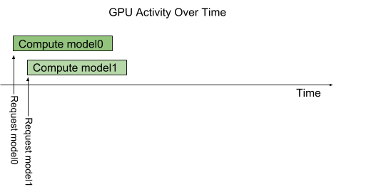

<!--
# Copyright 2018-2024, NVIDIA CORPORATION & AFFILIATES. All rights reserved.
#
# Redistribution and use in source and binary forms, with or without
# modification, are permitted provided that the following conditions
# are met:
#  * Redistributions of source code must retain the above copyright
#    notice, this list of conditions and the following disclaimer.
#  * Redistributions in binary form must reproduce the above copyright
#    notice, this list of conditions and the following disclaimer in the
#    documentation and/or other materials provided with the distribution.
#  * Neither the name of NVIDIA CORPORATION nor the names of its
#    contributors may be used to endorse or promote products derived
#    from this software without specific prior written permission.
#
# THIS SOFTWARE IS PROVIDED BY THE COPYRIGHT HOLDERS ``AS IS'' AND ANY
# EXPRESS OR IMPLIED WARRANTIES, INCLUDING, BUT NOT LIMITED TO, THE
# IMPLIED WARRANTIES OF MERCHANTABILITY AND FITNESS FOR A PARTICULAR
# PURPOSE ARE DISCLAIMED.  IN NO EVENT SHALL THE COPYRIGHT OWNER OR
# CONTRIBUTORS BE LIABLE FOR ANY DIRECT, INDIRECT, INCIDENTAL, SPECIAL,
# EXEMPLARY, OR CONSEQUENTIAL DAMAGES (INCLUDING, BUT NOT LIMITED TO,
# PROCUREMENT OF SUBSTITUTE GOODS OR SERVICES; LOSS OF USE, DATA, OR
# PROFITS; OR BUSINESS INTERRUPTION) HOWEVER CAUSED AND ON ANY THEORY
# OF LIABILITY, WHETHER IN CONTRACT, STRICT LIABILITY, OR TORT
# (INCLUDING NEGLIGENCE OR OTHERWISE) ARISING IN ANY WAY OUT OF THE USE
# OF THIS SOFTWARE, EVEN IF ADVISED OF THE POSSIBILITY OF SUCH DAMAGE.
-->

# Concurrent Model Execution

The Triton architecture allows multiple models and/or multiple
instances of the same model to execute in parallel on the same
system. The system may have zero, one, or many GPUs. The following
figure shows an example with two models; model0 and model1. Assuming
Triton is not currently processing any request, when two requests
arrive simultaneously, one for each model, Triton immediately
schedules both of them onto the GPU and the GPU’s hardware scheduler
begins working on both computations in parallel. Models executing on
the system's CPU are handled similarly by Triton except that the
scheduling of the CPU threads execution each model is handled by the
system's OS.



By default, if multiple requests for the same model arrive at the same
time, Triton will serialize their execution by scheduling only one at
a time on the GPU, as shown in the following figure.


Triton provides a [model configuration option called
instance-group](model_configuration.md#instance-groups) that allows
each model to specify how many parallel executions of that model
should be allowed. Each such enabled parallel execution is referred to
as an *instance*. By default, Triton gives each model a single
instance for each available GPU in the system. By
using the instance_group field in the model configuration, the number
of execution instances for a model can
be changed. The following figure shows model execution when model1
is configured to allow three instances. As shown in the figure, the
first three model1 inference requests are immediately executed in
parallel. The fourth model1 inference request must wait until one of
the first three executions completes before beginning.


# Models And Schedulers

Triton supports multiple scheduling and batching algorithms that can
be selected independently for each model.  This section describes
*stateless* and *stateful* models and how Triton provides
schedulers to support those model types. For a given model, the
selection and configuration of the scheduler is done with the [model's
configuration file](model_configuration.md).

## Stateless Models

With respect to Triton's schedulers, a *stateless* model does not
maintain state between inference requests. Each inference performed on
a stateless model is independent of all other inferences using that
model.

Examples of stateless models are CNNs such as image classification and
object detection. The [default
scheduler](scheduler.md#default-scheduler) or [dynamic
batcher](batcher.md#dynamic-batcher) can be used as the
scheduler for these stateless models.

RNNs and similar models which do have internal memory can be stateless
as long as the state they maintain does not span inference
requests. For example, an RNN that iterates over all elements in a
batch is considered stateless by Triton if the internal state is not
carried between batches of inference requests. The [default
scheduler](scheduler.md#default-scheduler) can be used for
these stateless models. The [dynamic
batcher](batcher.md#dynamic-batcher) cannot be used since
the model is typically not expecting the batch to represent multiple
inference requests.

## Stateful Models

With respect to Triton's schedulers, a *stateful* model does maintain
state between inference requests. The model is expecting multiple
inference requests that together form a sequence of inferences that
must be routed to the same model instance so that the state being
maintained by the model is correctly updated. Moreover, the model may
require that Triton provide *control* signals indicating, for example,
the start and end of the sequence.

The [sequence batcher](batcher.md#sequence-batcher) must
be used for these stateful models. As explained below, the sequence
batcher ensures that all inference requests in a sequence get routed
to the same model instance so that the model can maintain state
correctly. The sequence batcher also communicates with the model to
indicate when a sequence is starting, when a sequence is ending, when
a sequence has an inference request ready for execution, and the
*correlation ID* of the sequence.

When making inference requests for a stateful model, the client
application must provide the same correlation ID to all requests in a
sequence, and must also mark the start and end of the sequence. The
correlation ID allows Triton to identify that the requests belong to
the same sequence.

### Control Inputs

For a stateful model to operate correctly with the sequence batcher,
the model must typically accept one or more *control* input tensors
that Triton uses to communicate with the model. The
*ModelSequenceBatching::Control* section of the [model
configuration](model_configuration.md) indicates how the model exposes
the tensors that the sequence batcher should use for these
controls. All controls are optional. Below is portion of a model
configuration that shows an example configuration for all the
available control signals.

```
sequence_batching {
  control_input [
    {
      name: "START"
      control [
        {
          kind: CONTROL_SEQUENCE_START
          fp32_false_true: [ 0, 1 ]
        }
      ]
    },
    {
      name: "END"
      control [
        {
          kind: CONTROL_SEQUENCE_END
          fp32_false_true: [ 0, 1 ]
        }
      ]
    },
    {
      name: "READY"
      control [
        {
          kind: CONTROL_SEQUENCE_READY
          fp32_false_true: [ 0, 1 ]
        }
      ]
    },
    {
      name: "CORRID"
      control [
        {
          kind: CONTROL_SEQUENCE_CORRID
          data_type: TYPE_UINT64
        }
      ]
    }
  ]
}
```

* **Start**: The start input tensor is specified using
  CONTROL_SEQUENCE_START in the configuration. The example
  configuration indicates that the model has an input tensor called
  START with a 32-bit floating point data-type. The sequence batcher
  will define this tensor when executing an inference on the
  model. The START tensor must be 1-dimensional with size equal to the
  batch-size. Each element in the tensor indicates if the sequence in
  the corresponding batch slot is starting or not. In the example
  configuration, fp32_false_true indicates that a sequence start is
  indicated by tensor element equal to 1, and non-start is indicated
  by tensor element equal to 0.

* **End**: The end input tensor is specified using
  CONTROL_SEQUENCE_END in the configuration. The example configuration
  indicates that the model has an input tensor called END with a
  32-bit floating point data-type. The sequence batcher will define
  this tensor when executing an inference on the model. The END tensor
  must be 1-dimensional with size equal to the batch-size. Each
  element in the tensor indicates if the sequence in the corresponding
  batch slot is ending or not. In the example configuration,
  fp32_false_true indicates that a sequence end is indicated by tensor
  element equal to 1, and non-end is indicated by tensor element equal
  to 0.

* **Ready**: The ready input tensor is specified using
  CONTROL_SEQUENCE_READY in the configuration. The example
  configuration indicates that the model has an input tensor called
  READY with a 32-bit floating point data-type. The sequence batcher
  will define this tensor when executing an inference on the
  model. The READY tensor must be 1-dimensional with size equal to the
  batch-size. Each element in the tensor indicates if the sequence in
  the corresponding batch slot has an inference request ready for
  inference. In the example configuration, fp32_false_true indicates
  that a sequence ready is indicated by tensor element equal to 1, and
  non-ready is indicated by tensor element equal to 0.

* **Correlation ID**: The correlation ID input tensor is specified
  using CONTROL_SEQUENCE_CORRID in the configuration. The example
  configuration indicates that the model has an input tensor called
  CORRID with a unsigned 64-bit integer data-type. The sequence
  batcher will define this tensor when executing an inference on the
  model. The CORRID tensor must be 1-dimensional with size equal to
  the batch-size. Each element in the tensor indicates the correlation
  ID of the sequence in the corresponding batch slot.

### State Management for Stateful Models
[Implicit State Management](implicit_state_management.md#implicit-state-management)