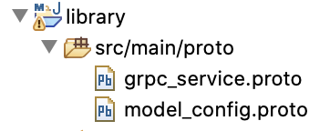
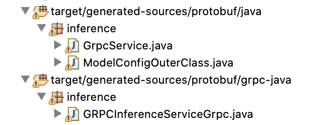

## Prerequsites

Maven 3.3+ and JDK 1.8+


## Generating java GRPC client stub

```
cd library
```

__Note__ the location of *.proto files, these files have been copied from [triton-inference-server
/server/src/core/](https://github.com/triton-inference-server/server/tree/master/src/core)




```
mvn compile
```
Once compiled, one should notice the generated *.java files under __target__ folder



## Use the generated files in any project

see the __examples__ project which has __scala__ and __java__ sample client. 

## Running java example client 

```
cd examples
```
```
mvn clean install exec:java -Dexec.mainClass=clients.SimpleJavaClient -Dexec.args="<host> <port>"
```

__host__  where triton inference server is running

__port__ default grpc port is 8001

## Running scala example client 

```
mvn clean install exec:java -Dexec.mainClass=clients.SimpleClient -Dexec.args="<host> <port>"
```

Both the examples run inference with respect to __simple__ model. The __scala__ example is more comprehensive and checks APIs like server ready and model ready

### Output of the scala client once run succesfully

```
name: "OUTPUT0"
datatype: "INT32"
shape: 2
shape: 16

2,4,6,8,10,12,14,16,18,20,22,24,26,28,30,32
34,36,38,40,42,44,46,48,50,52,54,56,58,60,62,64

name: "OUTPUT1"
datatype: "INT32"
shape: 2
shape: 16

0,0,0,0,0,0,0,0,0,0,0,0,0,0,0,0
0,0,0,0,0,0,0,0,0,0,0,0,0,0,0,0
```